# 1.关于SpringCloud:watermelon:

### 1. 版本的选择

>spring cloud版本是根据字母排序(A-Z)spring boot 以数字作为版本

`特别注意要根据springcloud来选择`

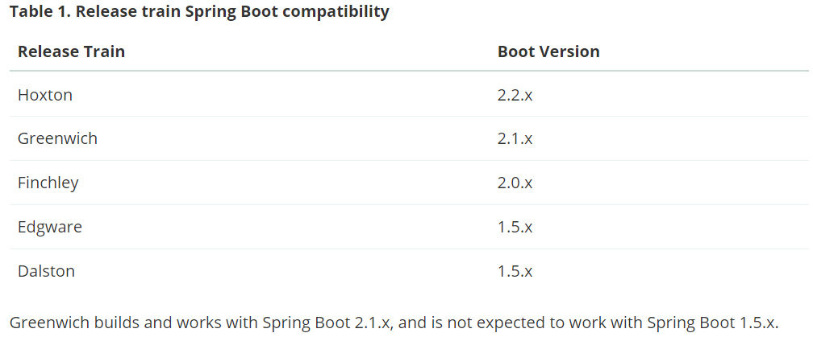

[具体版本查看方法](https://start.spring.io/actuator/info)("点这里")

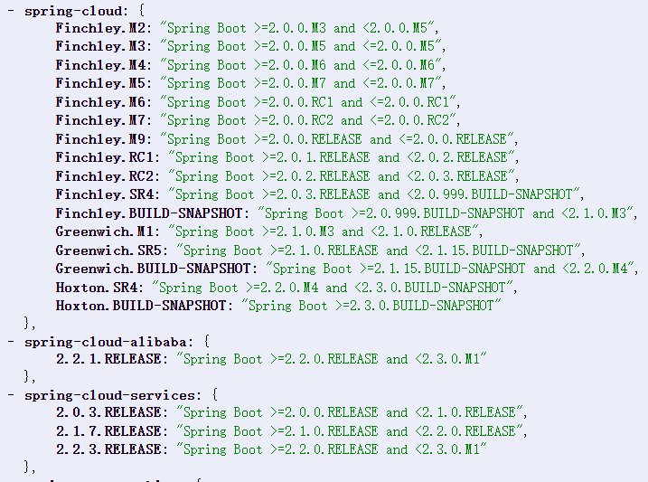

### 2. 停更引发的惨案

>1. 被动修复bug
>2. 不再接受合并请求
>3. 不在发布最新版本

|          |         过去         |                     现在                      |
| :------: | :------------------: | :-------------------------------------------: |
| 注册中心 |  Eureka(停止更新了)  | 1.Zookeeper,2.Consul(go语言),3.Nacos(Alibaba) |
| 服务调用 |        Ribbon        |       1.LoadBalancer,2.Ribbon还可以使用       |
| 服务调用 |  Feign(停止更新了)   |                   OpenFegin                   |
| 服务降级 | Hystrix(停止更新了)  |  1.resilience4j(老外用的)2.Sentinel(Alibaba)  |
| 服务网关 | Zuul(内部分裂作死了) |                gateWay(Spring)                |
| 服务配置 |        Config        |                Nacos(Alibaba)                 |
| 服务总线 |         Bus          |                Nacos(Alibaba)                 |

[具体信息看官方文档](https://cloud.spring.io/spring-cloud-static/Hoxton.SR4/reference/htmlsingle/)("点这里[^ 记着换springcloud的版本哦]")

# 2. Spring Cloud---入门:open_book:

打开idea创建maven项目

1. pom.xml文件

```xml
    <packaging>pom</packaging>

    <dependencies>
        <!--jdk 8以上版本问题-->
        <dependency>
            <groupId>javax.xml.bind</groupId>
            <artifactId>jaxb-api</artifactId>
            <version>2.3.0</version>
        </dependency>

        <dependency>
            <groupId>com.sun.xml.bind</groupId>
            <artifactId>jaxb-impl</artifactId>
            <version>2.3.0</version>
        </dependency>

        <dependency>
            <groupId>com.sun.xml.bind</groupId>
            <artifactId>jaxb-core</artifactId>
            <version>2.3.0</version>
        </dependency>

        <dependency>
            <groupId>javax.activation</groupId>
            <artifactId>activation</artifactId>
            <version>1.1.1</version>
        </dependency>

        <dependency>
            <groupId>org.projectlombok</groupId>
            <artifactId>lombok</artifactId>
            <optional>true</optional>
        </dependency>
    </dependencies>

	<!--这里是父工程子工程可以直接使用下列包但是要引入子工程可以不用写版本号-->
    <dependencyManagement>
        <dependencies>
            <dependency>
                <groupId>org.apache.maven.plugins</groupId>
                <artifactId>maven-project-info-reports-plugin</artifactId>
                <version>3.0.0</version>
            </dependency>

            <dependency>
                <groupId>org.springframework.boot</groupId>
                <artifactId>spring-boot-dependencies</artifactId>
                <version>2.2.5.RELEASE</version>
                <type>pom</type>
                <scope>import</scope>
            </dependency>

            <dependency>
                <groupId>org.springframework.cloud</groupId>
                <artifactId>spring-cloud-dependencies</artifactId>
                <version>Hoxton.SR5</version>
                <type>pom</type>
                <scope>import</scope>
            </dependency>

            <dependency>
                <groupId>com.alibaba.cloud</groupId>
                <artifactId>spring-cloud-alibaba-dependencies</artifactId>
                <version>2.2.1.RELEASE</version>
                <type>pom</type>
                <scope>import</scope>
            </dependency>

            <dependency>
                <groupId>mysql</groupId>
                <artifactId>mysql-connector-java</artifactId>
                <version>5.1.47</version>
                <scope>runtime</scope>
            </dependency>

            <dependency>
                <groupId>com.alibaba</groupId>
                <artifactId>druid</artifactId>
                <version>1.1.16</version>
            </dependency>

            <dependency>
                <groupId>org.mybatis.spring.boot</groupId>
                <artifactId>mybatis-spring-boot-starter</artifactId>
                <version>1.3.0</version>
            </dependency>

            <dependency>
                <groupId>junit</groupId>
                <artifactId>junit</artifactId>
                <version>4.12</version>
            </dependency>

            <dependency>
                <groupId>log4j</groupId>
                <artifactId>log4j</artifactId>
                <version>1.2.17</version>
            </dependency>
        </dependencies>
    </dependencyManagement>
```

2. 创建子工程

   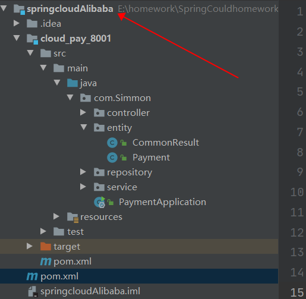

>创建新的Module(也就是子Module)

1. pom.xml文件

```xaml
<dependencies>
        <dependency>
            <groupId>org.springframework.cloud</groupId>
            <artifactId>spring-cloud-starter-zipkin</artifactId>
        </dependency>

        <dependency>
            <groupId>org.springframework.boot</groupId>
            <artifactId>spring-boot-starter-web</artifactId>
        </dependency>

        <dependency>
            <groupId>org.springframework.boot</groupId>
            <artifactId>spring-boot-starter-actuator</artifactId>
        </dependency>

        <dependency>
            <groupId>com.alibaba</groupId>
            <artifactId>druid-spring-boot-starter</artifactId>
            <version>1.1.10</version>
        </dependency>

        <dependency>
            <groupId>mysql</groupId>
            <artifactId>mysql-connector-java</artifactId>
        </dependency>

        <dependency>
            <groupId>org.springframework.boot</groupId>
            <artifactId>spring-boot-starter-jdbc</artifactId>
        </dependency>

        <dependency>
            <groupId>org.mybatis.spring.boot</groupId>
            <artifactId>mybatis-spring-boot-starter</artifactId>
        </dependency>

        <dependency>
            <groupId>org.projectlombok</groupId>
            <artifactId>lombok</artifactId>
            <version>1.18.10</version>
            <optional>true</optional>
        </dependency>

        <dependency>
            <groupId>org.springframework.boot</groupId>
            <artifactId>spring-boot-starter-test</artifactId>
            <scope>test</scope>
        </dependency>
    </dependencies>
```

2. 在==子工程==resources下创建一个新的包和application.yml

   

3. application.yml

   ```yaml
   server:
     port: 8001
   spring:
     application:
       name: cloud-payment-service
     datasource:
       url: jdbc:mysql://localhost:3306/db2019?useUnicode=true&characterEncoding=UTF-8&serverTimezone=UTC&useSSL=false
       username: root
       password: 1234
       driver-class-name: com.mysql.jdbc.Driver
       type: com.alibaba.druid.pool.DruidDataSource
   mybatis:
     mapper-locations: classpath:/mapper/*.xml
     type-aliases-package: com.Simmon.entity
   ```

   4. 

      1. 创建数据库名为db2019

      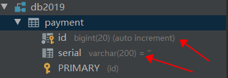

      2. 创建一个为Payment的表(随便加些字段)

   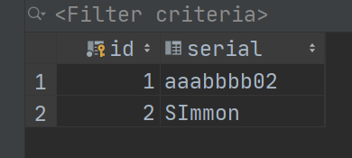

5. idea中的java文件下建包

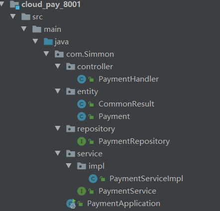

entity包

Payment.class

```java
@Data
@AllArgsConstructor
@NoArgsConstructor
public class Payment implements Serializable {/*序列化*/
    private Long id;
    private String serial;
}
```

CommonRsult.class

```java
@Data
@AllArgsConstructor
@NoArgsConstructor
public class CommonResult<T> {//给一个泛型返回给前端页面
    private Integer code;
    private String message;
    private T data;

    public CommonResult(Integer code,String message){
        this(code,message,null);
    }
}
```

repository

PaymentRepostory.interface

```java
@Repository
public interface PaymentRepository {
    public int create(Payment payment);
    public Payment getPaymentById(@Param("id") Long id);
}
```

service

PaymentService.interface

```java
public interface PaymentService {
    public int create(Payment payment);
    public Payment getPaymentById(@Param("id") Long id);
}
```

service.impl

PaymentServiceImpl.class

```java
@Service
public class PaymentServiceImpl implements PaymentService {

    @Autowired
    private PaymentRepository paymentRepository;

    public int create(Payment payment) {
        return paymentRepository.create(payment);
    }

    public Payment getPaymentById(Long id) {
        return paymentRepository.getPaymentById(id);
    }
}
```

controller

PaymentHandler.class

```java
@RestController
@Slf4j
@RequestMapping("/payment")
public class PaymentHandler {

    @Autowired
    private PaymentService paymentService;

    @PostMapping("/create")
    public CommonResult create(@RequestBody Payment payment){
        int result=paymentService.create(payment);
        log.info("***插入结果"+result);
        if (result>0){
            return new CommonResult(200,"插入数据库成功",result);
        }else {
            return new CommonResult(444,"插入数据库失败",null);
        }
    }

    @GetMapping("/getPaymentById/{id}")
    public CommonResult getPaymentById(@PathVariable("id") Long id){
        Payment payment=paymentService.getPaymentById(id);
        log.info("***插入结果"+payment);
        if (payment!=null){
            return new CommonResult(200,"查询数据库成功",payment);
        }else {
            return new CommonResult(444,"查询数据库失败该id失败--->"+id,null);
        }
    }
}
```

com.Simmon.PaymentApplication.class(==注意这个`类`要在所有包的最外层这样才能扫面你写的文件==)

```java
@SpringBootApplication
@MapperScan("com.Simmon.repository")
public class PaymentApplication {
    public static void main(String[] args) {
        SpringApplication.run(PaymentApplication.class,args);
    }
}
```

resources


PaymentMapper.xml

```xml
<?xml version="1.0" encoding="UTF-8" ?>
<!DOCTYPE mapper PUBLIC "-//mybatis.org//DTD Mapper 3.0//EN"
        "http://mybatis.org/dtd/mybatis-3-mapper.dtd">
<mapper namespace="com.Simmon.repository.PaymentRepository">
    <insert id="create" parameterType="Payment" useGeneratedKeys="true" keyProperty="id">
        insert into payment(serial) values(#{serial});
    </insert>

    <resultMap id="BaseResultMap" type="com.Simmon.entity.Payment">
        <id column="id" property="id" jdbcType="BIGINT"></id>
        <result column="serial" property="serial" jdbcType="VARCHAR"></result>
    </resultMap>
    <select id="getPaymentById" parameterType="java.lang.Long" resultMap="BaseResultMap">
        select * from payment where id=#{id};
    </select>
</mapper>
```

## 1. 热部署_Devtools

1. 在子工程中的pom.xml添加

```xml
		<dependency>
            <groupId>org.springframework.boot</groupId>
            <artifactId>spring-boot-devtools</artifactId>
            <scope>runtime</scope>
            <optional>true</optional>
        </dependency>
```

2. 在父工程的pom.xml下添加(`在<project>标签中哦`)

   ```xml
   <build>
           <plugins>
               <plugin>
                   <groupId>org.springframework.boot</groupId>
                   <artifactId>spring-boot-maven-plugin</artifactId>
                   <configuration>
                       <fork>true</fork>
                       <addResources>true</addResources>
                   </configuration>
               </plugin>
           </plugins>
       </build>
   ```

3. File-->settings-->Compiler

   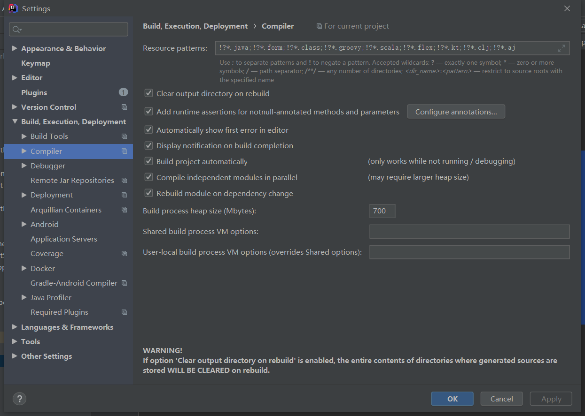

4. ctrl+alt+shift+/  ----->+enter

   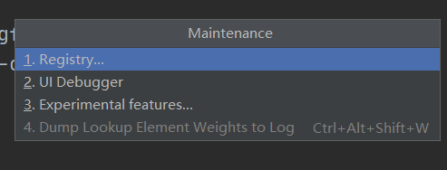

5. 

   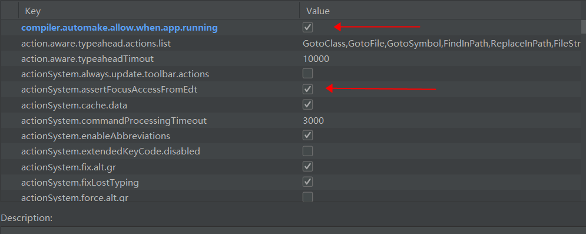

6. 重启idea-----ok

   >后面写代码就可以自动重启和update

## 2. 消费者订单---80

>1. 创建新的module
>
>2. 建包
>
>   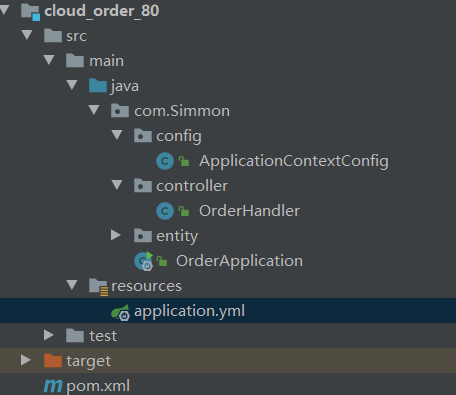

pom.xml

```xml
<dependencies>
        <dependency>
            <groupId>org.springframework.boot</groupId>
            <artifactId>spring-boot-starter-web</artifactId>
        </dependency>
        <!--监控-->
        <dependency>
            <groupId>org.springframework.boot</groupId>
            <artifactId>spring-boot-starter-actuator</artifactId>
        </dependency>
        <!--热部署-->
        <dependency>
            <groupId>org.springframework.boot</groupId>
            <artifactId>spring-boot-devtools</artifactId>
            <scope>runtime</scope>
            <optional>true</optional>
        </dependency>
        <dependency>
            <groupId>org.projectlombok</groupId>
            <artifactId>lombok</artifactId>
            <optional>true</optional>
        </dependency>
        <dependency>
            <groupId>org.springframework.boot</groupId>
            <artifactId>spring-boot-starter-test</artifactId>
            <scope>test</scope>
        </dependency>
    </dependencies>
```

application.yml

```yaml
server:
  port: 80
```

>为什么用80呢???
>
>​	应为客户端访问的时候可以去掉80端口直接访问如--------localhost/xxx/xxxx

entity中的包

>跟上面的一样全部copy过来

controller

​	orederHandler.class

```java
@RestController
@RequestMapping("/order")
@Slf4j
public class OrderHandler {

    public static final String PAYMENT_URL="http://localhost:8001/payment";

    //这里也可以用@Resource
    @Autowired
    private RestTemplate restTemplate;

    @GetMapping("/payment/create")
    public CommonResult<Payment> create(Payment payment){
        return restTemplate.postForObject(PAYMENT_URL+"/create",payment,CommonResult.class);
    }

    @GetMapping("/payment/getPaymentById/{id}")
    public CommonResult<Payment> getPayment(@PathVariable("id") Long id){
        return restTemplate.getForObject(PAYMENT_URL+"/getPaymentById/"+id,CommonResult.class);
    }
}
```

config

ApplicationContextConfig.class

```java
@Configuration
public class ApplicationContextConfig {
    @Bean
    public RestTemplate getResetTemplate(){
        return new RestTemplate();
    }
}
```

最后添加启动类启动就OK

## 3. 工程重构

创建子工程cloud_api

1. 将entity包拷贝过去

2. pom.xml

```xml
<dependencies>
        <dependency>
            <groupId>org.springframework.boot</groupId>
            <artifactId>spring-boot-devtools</artifactId>
            <scope>runtime</scope>
            <optional>true</optional>
        </dependency>

        <dependency>
            <groupId>org.projectlombok</groupId>
            <artifactId>lombok</artifactId>
            <version>1.18.12</version>
            <optional>true</optional>
        </dependency>

        <dependency>
            <groupId>cn.hutool</groupId>
            <artifactId>hutool-all</artifactId>
            <version>5.1.0</version>
        </dependency>
    </dependencies>
```

3. 将其他的pom.xml修改

   `注意这里引入的是你的工程下的包所以请按照你的命名格式引入`[^ 这是我的子工程]

   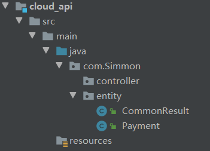

   如cloud_80-->pom.xml("添加以下内容")后面将8001也也一起修改

   ```xml
   		<dependency>
               <groupId>com.Simmon</groupId>
               <artifactId>cloud_api</artifactId>
               <version>1.0-SNAPSHOT</version>
           </dependency>
   ```

4. 启动端口测试就ok了

# 3. 注册中心:euro:

## 1. Eureka

Eureka Server提供服务注册

>* 各个服务节点通过配置启动后,会在EurekaServer中进行注册,这样EurekaServer中的服务注册表中将会存储所有可用服务节点的信息,服务节点的信息可以在界面中直观看到

EurekaClient通过注册中心进行访问

>* 是一个java客户端,用于简化EurekaServer的交互,客户端同时也具备一个内置的,使用轮询(`round-robin`)算法的负载均衡器.在应用启动后,将会向EurakeServer发送信息(`默认周期30秒`),如果EurekaServer在多个运行周期没有接收到某个节点的信息,EurekaServer将会把该节点从注册中心移除(`默认90秒`)

1. 创建子模块module

   pom.xml

   ```xml
   <dependencies>
               <dependency>
                   <groupId>org.springframework.cloud</groupId>
                   <artifactId>spring-cloud-starter-netflix-eureka-server</artifactId>
               </dependency>
   
               <!--自己的架包-->
               <dependency>
                   <groupId>com.Simmon</groupId>
                   <artifactId>cloud_api</artifactId>
                   <version>1.0-SNAPSHOT</version>
               </dependency>
   
               <dependency>
                   <groupId>org.springframework.boot</groupId>
                   <artifactId>spring-boot-starter-web</artifactId>
               </dependency>
               <!--监控-->
               <dependency>
                   <groupId>org.springframework.boot</groupId>
                   <artifactId>spring-boot-starter-actuator</artifactId>
               </dependency>
               <!-- 一般通用配置 -->
               <dependency>
                   <groupId>org.springframework.boot</groupId>
                   <artifactId>spring-boot-devtools</artifactId>
                   <scope>runtime</scope>
                   <optional>true</optional>
               </dependency>
               <dependency>
                   <groupId>org.projectlombok</groupId>
                   <artifactId>lombok</artifactId>
                   <version>1.18.12</version>
                   <optional>true</optional>
               </dependency>
               <dependency>
                   <groupId>org.springframework.boot</groupId>
                   <artifactId>spring-boot-starter-test</artifactId>
                   <scope>test</scope>
               </dependency>
           </dependencies>
   ```

2. 创建EurekaServerApplication

   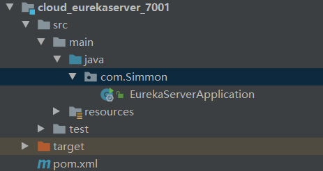

```java
@SpringBootApplication
@EnableEurekaServer
public class EurekaServerApplication {
    public static void main(String[] args) {
        SpringApplication.run(EurekaServerApplication.class,args);
    }
}
```

3. 在resources下创建application.yml

   ```yaml
   server:
     port: 7001
   eureka:
     instance:
       hostname: localhost
     client:
       #是否自己注册自己
       register-with-eureka: false
       fetch-registry: false
       service-url:
         defaultZone: http://${eureka.instance.hostname}:${server.port}/eureka/
   ```

4. 修改cloud_pay和cloud_order的application.yml

   cloud_pay---->application.yml

   ```yaml
   server:
     port: 8001
   spring:
     application:
     	#这里千万不要用下滑线命名spring将扫描不了
       name: cloud-payment-service
     datasource:
       url: jdbc:mysql://localhost:3306/db2019?useUnicode=true&characterEncoding=UTF-8&serverTimezone=UTC&useSSL=false
       username: root
       password: 1234
       driver-class-name: org.gjt.mm.mysql.Driver
       type: com.alibaba.druid.pool.DruidDataSource
   mybatis:
     mapper-locations: classpath:/mapper/*.xml
     type-aliases-package: com.Simmon.entity
   eureka:
     client:
       register-with-eureka: true
       fetch-registry: true
       service-url:
         defaultZone: http://localhost:7001/eureka
   ```

   cloud_order---->application.yml

   ```yaml
   server:
     port: 80
   spring:
     application:
       name: cloud_order_service
   eureka:
     client:
       register-with-eureka: true
       fetch-registry: true
       service-url:
         defaultZone: http://localhost:7001/eureka
   ```

5. 修改cloud_pay和cloud_order的启动类

   cloud_pay---->PaymentApplication.class

   ```java
   @SpringBootApplication
   @EnableEurekaClient
   @MapperScan("com.Simmon.repository")
   public class PaymentApplication {
       public static void main(String[] args) {
           SpringApplication.run(PaymentApplication.class,args);
       }
   }
   ```

   cloud_order---->OrderApplication.class

   ```java
   @SpringBootApplication
   @EnableEurekaClient
   public class OrderApplication {
       public static void main(String[] args) {
           SpringApplication.run(OrderApplication.class,args);
       }
   }
   ```

### 1. Eureka集群搭建

==注意==:`该工程耗费运行内存,运行内存为8g的最好不写`

修改hosts文件(C:\Windows\System32\drivers\etc)向里面添加

```spreadsheet
#############SpringCloud##############
127.0.0.1       eureka7001.com
127.0.0.1       eureka7002.com
```

创建一个子工程module

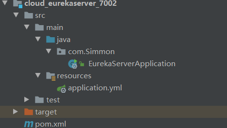

pom.xml

```xml
<dependencies>
        <dependency>
            <groupId>org.springframework.cloud</groupId>
            <artifactId>spring-cloud-starter-netflix-eureka-server</artifactId>
            <version>2.2.2.RELEASE</version>
        </dependency>

        <!--自己的架包-->
        <dependency>
            <groupId>com.Simmon</groupId>
            <artifactId>cloud_api</artifactId>
            <version>1.0-SNAPSHOT</version>
        </dependency>

        <dependency>
            <groupId>org.springframework.boot</groupId>
            <artifactId>spring-boot-starter-web</artifactId>
        </dependency>
        <!--监控-->
        <dependency>
            <groupId>org.springframework.boot</groupId>
            <artifactId>spring-boot-starter-actuator</artifactId>
        </dependency>
        <!-- 一般通用配置 -->
        <dependency>
            <groupId>org.springframework.boot</groupId>
            <artifactId>spring-boot-devtools</artifactId>
            <scope>runtime</scope>
            <optional>true</optional>
        </dependency>
        <dependency>
            <groupId>org.projectlombok</groupId>
            <artifactId>lombok</artifactId>
            <version>1.18.12</version>
            <optional>true</optional>
        </dependency>
        <dependency>
            <groupId>org.springframework.boot</groupId>
            <artifactId>spring-boot-starter-test</artifactId>
            <scope>test</scope>
        </dependency>
    </dependencies>
```

application.yml

```yaml
server:
  port: 7002
eureka:
  instance:
    hostname: eureka7002.com
  client:
    #是否自己注册自己
    register-with-eureka: false
    fetch-registry: false
    service-url:
      defaultZone: http://eureka7001.com:7001/eureka/
```

创建启动类EurekaServerApplication.class

```java
@SpringBootApplication
@EnableEurekaServer
public class EurekaServerApplication {
    public static void main(String[] args) {
        SpringApplication.run(EurekaServerApplication.class,args);
    }
}
```


修改以前的eurekaServer的application.yml

```yml
server:
  port: 7001
eureka:
  instance:
    hostname: eureka7001.com
  client:
    #是否自己注册自己
    register-with-eureka: false
    fetch-registry: false
    service-url:
      defaultZone: http://eureka7002.com:7002/eureka/
```

### 2. 将服务注册到集群里

1. 创建子工程

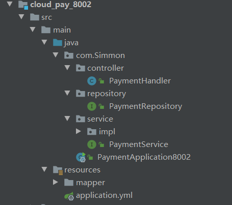

​		将cloud_pay8001中的全部copy过来,然后修改yml端口号

2.  为了区分端口号在controller中的PaymentHandler添加端口号

​	PayementHandler.class

```java
@RestController
@Slf4j
@RequestMapping("/payment")
public class PaymentHandler {

    @Autowired
    private PaymentService paymentService;

    @Value("${server.port}")
    private String serverPort;

    @PostMapping("/create")
    public CommonResult create(@RequestBody Payment payment){
        int result=paymentService.create(payment);
        log.info("***插入结果"+result);
        if (result>0){
            return new CommonResult(200,"插入数据库成功,serverPort"+serverPort,result);
        }else {
            return new CommonResult(444,"插入数据库失败",null);
        }
    }

    @GetMapping("/getPaymentById/{id}")
    public CommonResult<Payment> getPaymentById(@PathVariable("id") Long id){
        Payment payment=paymentService.getPaymentById(id);
        log.info("***插入结果"+payment);
        if (payment!=null){
            return new CommonResult(200,"查询数据库成功,serverPort"+serverPort,payment);
        }else {
            return new CommonResult(444,"查询数据库失败该id失败--->"+id,null);
        }
    }
}
```

4. 修改cloud_order中的config

   ApplicationContextConfig.class

```java
@Configuration
public class ApplicationContextConfig {
    @Bean
    @LoadBalanced
    public RestTemplate getResetTemplate(){
        return new RestTemplate();
    }
}
```

5. 修改controller中的Handler

   ````java
   @RestController
   @RequestMapping("/order")
   @Slf4j
   public class OrderHandler {
   
       /*public static final String PAYMENT_URL="http://localhost:8001/payment";*/
       public static final String PAYMENT_URL="http://cloud-payment-service/payment";
   
   
       @Autowired
       private RestTemplate restTemplate;
   
       @GetMapping("/payment/create")
       public CommonResult<Payment> create(Payment payment){
           return restTemplate.postForObject(PAYMENT_URL+"/create",payment,CommonResult.class);
       }
   
       @GetMapping("/payment/getPaymentById/{id}")
       public CommonResult<Payment> getPayment(@PathVariable("id") Long id){
           return restTemplate.getForObject(PAYMENT_URL+"/getPaymentById/"+id,CommonResult.class);
       }
   }
   ````

### 3. 服务信息完善

向`cloud_pay`8001和8002中的yml文件添加

```yaml
server:
  port: 8001
spring:
  application:
    name: cloud-payment-service
  datasource:
    url: jdbc:mysql://localhost:3306/db2019?useUnicode=true&characterEncoding=UTF-8&serverTimezone=UTC&useSSL=false
    username: root
    password: 1234
    driver-class-name: org.gjt.mm.mysql.Driver
    type: com.alibaba.druid.pool.DruidDataSource
mybatis:
  mapper-locations: classpath:/mapper/*.xml
  type-aliases-package: com.Simmon.entity
eureka:
  client:
    register-with-eureka: true
    fetch-registry: true
    service-url:
      #defaultZone: http://localhost:7001/eureka
      defaultZone: http://eureka7001.com:7001/eureka,http://eureka7002.com:7002/eureka
  instance:
    instance-id: payment8001
    prefer-ip-address: true
```

### 4. 服务发现Discovery

1. 修改cloud_pay_8001的controller`添加一下内容`

   ```java
   	@Autowired
       private DiscoveryClient discoveryClient;
   
   	@GetMapping("/discovery")
       public Object discovery(){
           List<String> list=discoveryClient.getServices();
           for (String element : list) {
               log.info("*****element*****");
           }
   
           List<ServiceInstance> instances=discoveryClient.getInstances("cloud-payment-service");
           for (ServiceInstance instance : instances) {
               log.info(instance.getServiceId()+"\t"+instance.getHost()+"\t"+instance.getUri());
           }
           return this.discoveryClient;
       }
   ```

2. 在启动类加上这个注解

   ```java
   @EnableDiscoveryClient
   ```

==同里如果你写了8002copy过去就完事了==

>这里说明一下:
>
>​	这个方法的意思就是查找`服务名称`,`服务端口`,`服务链接`

### 5. Eureka自我保护机制

概述

>Eureka Server将尝试保护其服务注册表中的信息,不再删除服务注册表中的数据,也就是不会注销任何服务,`如果出现下面图片就进入了保护机制`


==属于cap中的ap分支==

#### 1.暂停保护机制

修改eurekaserver_7001

application.yml

```yaml
server:
  port: 7001
eureka:
  instance:
    hostname: eureka7001.com
  client:
    #是否自己注册自己
    register-with-eureka: false
    fetch-registry: false
    service-url:
      #defaultZone: http://eureka7002.com:7002/eureka/
      #单机模式
      defaultZone: http://eureka7001.com:7001/eureka/
  server:
    #关闭自我保护
    enable-self-preservation: false
    #只允许断链2s
    eviction-interval-timer-in-ms: 2000
```

修改cloud_pay8001

application.yml

```yaml
server:
  port: 8001
spring:
  application:
    name: cloud-payment-service
  datasource:
    url: jdbc:mysql://localhost:3306/db2019?useUnicode=true&characterEncoding=UTF-8&serverTimezone=UTC&useSSL=false
    username: root
    password: 1234
    driver-class-name: org.gjt.mm.mysql.Driver
    type: com.alibaba.druid.pool.DruidDataSource
mybatis:
  mapper-locations: classpath:/mapper/*.xml
  type-aliases-package: com.Simmon.entity
eureka:
  client:
    register-with-eureka: true
    fetch-registry: true
    service-url:
      defaultZone: http://localhost:7001/eureka
      #defaultZone: http://eureka7001.com:7001/eureka,http://eureka7002.com:7002/eureka
  instance:
    instance-id: payment8001
    prefer-ip-address: true
    #eureka客户端向服务端响应时间间隔,单位秒(默认30s)
    lease-renewal-interval-in-seconds: 1
    #eureka服务端在收到最后一次响应的时限,单位秒,超时将剔除服务(默认90s)
    lease-expiration-duration-in-seconds: 2
```

>实现:
>
>​		启动两个服务然后关闭8001服务2s后刷新页面,8001服务将会被剔出

## 2. Consul

1. 下载Consul([点这里](https://learn.hashicorp.com/consul))`go语言`

2. 运行cmd

   >consul --version -----`查看版本号`
   >
   >consul agent -dev ------`开启运行`

3. 运行成功后在网页上看localhost:8500

新建子工程

pom.xml

```xml
<dependency>
   			 <!--自己的包-->
            <groupId>com.Simmon</groupId>
            <artifactId>cloud_api</artifactId>
            <version>1.0-SNAPSHOT</version>
        </dependency>

        <dependency>
            <groupId>org.springframework.boot</groupId>
            <artifactId>spring-boot-starter-web</artifactId>
        </dependency>
        <!--监控-->
        <dependency>
            <groupId>org.springframework.boot</groupId>
            <artifactId>spring-boot-starter-actuator</artifactId>
        </dependency>
        <!--SpringCloud consul-server-->
        <!-- https://mvnrepository.com/artifact/org.springframework.cloud/spring-cloud-starter-consul-discovery -->
        <dependency>
            <groupId>org.springframework.cloud</groupId>
            <artifactId>spring-cloud-starter-consul-discovery</artifactId>
            <version>2.2.1.RELEASE</version>
        </dependency>

        <!--热部署-->
        <dependency>
            <groupId>org.springframework.boot</groupId>
            <artifactId>spring-boot-devtools</artifactId>
            <scope>runtime</scope>
            <optional>true</optional>
        </dependency>

        <dependency>
            <groupId>org.projectlombok</groupId>
            <artifactId>lombok</artifactId>
            <optional>true</optional>
        </dependency>

        <dependency>
            <groupId>org.springframework.boot</groupId>
            <artifactId>spring-boot-starter-test</artifactId>
            <scope>test</scope>
        </dependency>
```

application.yml

```yaml
server:
  port: 8006
spring:
  application:
    name: consul-provider-payment
  cloud:
    consul:
      host: localhost
      port: 8500
      discovery:
        service-name: ${spring.application.name}
```

创建业务层和启动类

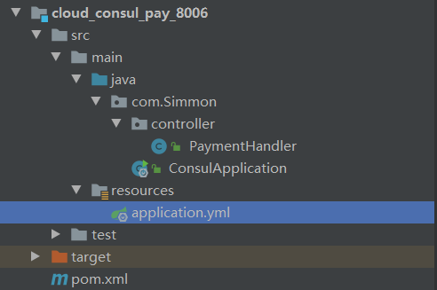

PaymentHandler.class

```java
@RestController
@Slf4j
@RequestMapping("/payment")
public class PaymentHandler {
    @Value("${server.port}")
    private String serverPort;

    @GetMapping("/consul")
    public String paymentConsul(){
        return "SpringCloud with consul:"+serverPort+"\t"+ UUID.randomUUID().toString();
    }
}
```

启动类

```java
@SpringBootApplication
@EnableDiscoveryClient
public class ConsulApplication {
    public static void main(String[] args) {
        SpringApplication.run(ConsulApplication.class,args);
    }
}
```

新建子工程consul_order

application.yml

```yaml
server:
  port: 80

spring:
  application:
    name: cloud_consul_order
  cloud:
    consul:
      host: localhost
      port: 8500
      discovery:
        service-name: ${spring.application.name}
```

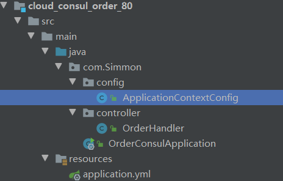

OrderHandler.class

```java
@RestController
@RequestMapping("/order")
@Slf4j
public class OrderHandler {

    /*public static final String PAYMENT_URL="http://localhost:8001/payment";*/
    public static final String PAYMENT_URL="http://consul-provider-payment/payment";


    @Autowired
    private RestTemplate restTemplate;

    @GetMapping("/payment/consul")
    public String paymentInfo(){
        String result=restTemplate.getForObject(PAYMENT_URL+"/consul",String.class);
        return result;
    }

}
```

ApplicationContextConfig.class

```java
@Configuration
public class ApplicationContextConfig {
    @Bean
    @LoadBalanced
    public RestTemplate getResetTemplate(){
        return new RestTemplate();
    }
}
```

启动类

```java
@SpringBootApplication
@EnableDiscoveryClient
public class OrderConsulApplication {
    public static void main(String[] args) {
        SpringApplication.run(OrderConsulApplication.class,args);
    }
}
```

# 4. 服务调用:arrow_right_hook:

## 1. Ribbon

>负载均衡
>
>* 将用户的请求平摊的分配到多个服务上,从而达到系统的高可用(HA)

restTemplate:

>getForObject()和getForEntity()的区别
>
>getForObject():返回对象为响应体中数据转化成的对象,基本可以理解为`Json`
>
>getForEntity():返回对象为ResponseEntity对象,包含了响应中的一些重要信息,比如响应头,响应状态码,响应体等

Ribbon中的核心组件IRULE

>* com.netflix.loadbalancer.RoundRobinRule---`轮询算法`
>* com.netflix.loadbalancer.RandomRule---`随机算法`
>* com.netflix.loadbalancer.RetryRule---`一定时限内循环重试.先按照RoundRobinRule的策略获取服务,如果获取服务失败则在指定时间内会进行重试,获取可用服务`
>* WeightedResponseTimeRule---`最小响应时间.对RoundRobinRule的扩展,响应速度越快的实例选择权重越大,越容易被选择`
>* BestAvailableRule---`最小连接数.会优先过滤由于多次访问故障而处于断路器跳闸状态的服务,然后选择一个并发量小的服务`
>* AvailabilityFilteringRule---`扩展了轮询策略.会过滤掉故障实例,在选择并发较小的实例`
>* ZoneAvoidanceRule---`扩展了轮询策略，继承了2个过滤器.默认规则,复合判断server所在区域的性能和server的可用性能和server的可用性选择服务器`

写一个随机算法

在order下创建一个包

>==注意==这个包不能被启动类扫到(@ComponentScan)所以创建在上级

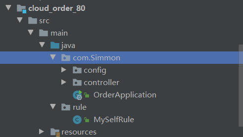

MySelfRule.class

```java
@Configuration
public class MySelfRule {
    @Bean
    public IRule myRule(){
        return new RandomRule();
    }
}
```

然后启动类加上注解

```java
@SpringBootApplication
@EnableEurekaClient
@RibbonClient(name = "cloud-payment-service",configuration = MySelfRule.class)
public class OrderApplication {
    public static void main(String[] args) {
        SpringApplication.run(OrderApplication.class,args);
    }
}

```

>这里的cloud-payment-service---------指的是提供服务的名称(`注意是服务提供者`)

负载均衡算法原理:

>* rest接口请求数 % 服务器集群总数量=实际调用服务器位置下标.每次服务启动后rest接口计数从1开始

自己写一个轮循算法

在8001和8002的controller包中的类加上一下代码

```java
    @GetMapping("/lb")
    public String getPayment(){
        return serverPort;
    }
```

在80端口下创建包

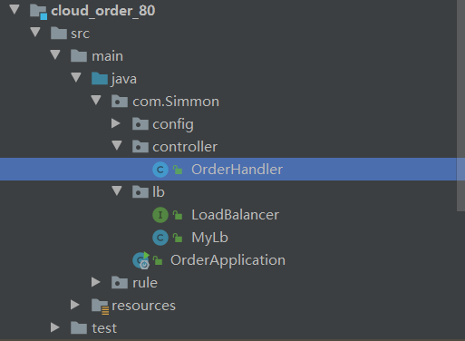

LoadBalancer.interface

```java
public interface LoadBalancer {
    ServiceInstance instances(List<ServiceInstance> serviceInstances);
}
```

MyLb.class

```java
@Component
public class MyLb implements LoadBalancer{

    private AtomicInteger atomicInteger=new AtomicInteger(0);
    public final int getAndIncrement(){
        int current,next;
        do {
            current=this.atomicInteger.get();
            next=current>=214748364 ? 0:current+1;

        }while (!this.atomicInteger.compareAndSet(current,next));
        System.out.println("*******next"+next);
        return next;
    }

    @Override
    public ServiceInstance instances(List<ServiceInstance> serviceInstances) {
        int index=getAndIncrement()%serviceInstances.size();
        return serviceInstances.get(index);
    }
}
```

OrederHandler.class添加

```java
	@GetMapping("/payment/lb")
    public String getPaymentLb(){
        List<ServiceInstance> instances=discoveryClient.getInstances("CLOUD-PAYMENT-SERVICE");
        if (instances==null || instances.size()<=0){
            return null;
        }else {
            ServiceInstance serviceInstance=loadBalancer.instances(instances);
            URI uri=serviceInstance.getUri();

            return restTemplate.getForObject(uri+"/payment/lb",String.class);
        }
    }
```

config中的类

ApplicationContextConfig.class(==注释掉@LoadBalanced==)

```java
@Configuration
public class ApplicationContextConfig {
    @Bean
    //@LoadBalanced
    public RestTemplate getResetTemplate(){
        return new RestTemplate();
    }
}
```

## 2. OpenFeign

>在feign的基础上添加了springmvc的支持,如:@RequsetMapping

使用步骤

1. 创建子工程(cloud_orderOpenFegin_80)

2. pom.xml

   ```xml
   <dependencies>
           <dependency>
               <groupId>org.springframework.cloud</groupId>
               <artifactId>spring-cloud-starter-openfeign</artifactId>
           </dependency>
   
           <dependency>
               <groupId>org.springframework.cloud</groupId>
               <artifactId>spring-cloud-starter-netflix-eureka-client</artifactId>
           </dependency>
   
           <dependency>
               <groupId>com.Simmon</groupId>
               <artifactId>cloud_api</artifactId>
               <version>1.0-SNAPSHOT</version>
           </dependency>
   
           <dependency>
               <groupId>org.springframework.boot</groupId>
               <artifactId>spring-boot-starter-web</artifactId>
           </dependency>
   
           <dependency>
               <groupId>org.springframework.boot</groupId>
               <artifactId>spring-boot-starter-actuator</artifactId>
           </dependency>
           <dependency>
               <groupId>org.springframework.boot</groupId>
               <artifactId>spring-boot-devtools</artifactId>
               <scope>runtime</scope>
               <optional>true</optional>
           </dependency>
           <dependency>
               <groupId>org.projectlombok</groupId>
               <artifactId>lombok</artifactId>
               <optional>true</optional>
           </dependency>
           <dependency>
               <groupId>org.springframework.boot</groupId>
               <artifactId>spring-boot-starter-test</artifactId>
               <scope>test</scope>
           </dependency>
       </dependencies>
   ```

3. application.yml

   ```yaml
   server:
     port: 80
   eureka:
     client:
       register-with-eureka: false
       service-url:
         defaultZone: http://eureka7001.com:7001/eureka,http://eureka7002.com:7002/eureka
   ```

4. 创建文件夹

   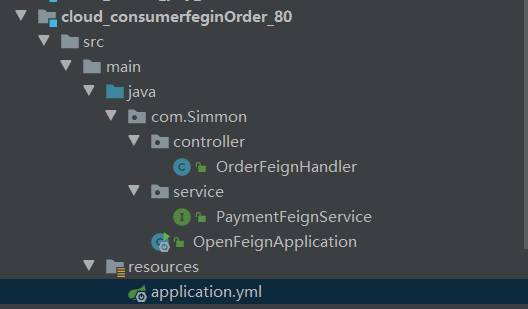

controller

OrderFeignHandler.class

```java
@RestController
@Slf4j
@RequestMapping("/OrderFeign")
public class OrderFeignHandler {

    @Autowired
    private PaymentFeignService paymentFeignService;

    @GetMapping("/payment/getPaymentById/{id}")
    public CommonResult<Payment> getPaymentById(@PathVariable("id") Long id){
        return paymentFeignService.getPayment(id);
    }
}
```

service

```java
@Component
@FeignClient(value = "cloud-payment-service")
public interface PaymentFeignService {
    @GetMapping("/payment/getPaymentById/{id}")
    public CommonResult<Payment> getPayment(@PathVariable("id") Long id);
}
```

>注解:
>
>​	这里的意思就这样理解,消费者要去超市买东西,超市就是提供食物的一方供消费者消费
>
>官方:
>
>​	这里通过cloud-payment-service的服务名称去调用该服务名称中的方法,将其映射到该服务中
>
>​	也就是其他服务去调用cloud-payment-service的方法

启动类

OpenFeignApplication.class

```java
@SpringBootApplication
@EnableFeignClients
public class OpenFeignApplication {
    public static void main(String[] args) {
        SpringApplication.run(OpenFeignApplication.class,args);
    }
}
```

>@EnableFeignClients
>
>​	这个注解的意思就是这个类作为消费者去调提供者的接口就完事了

### openfeign超时控制

1.在controller中的OrderHandler.class添加

```java
@GetMapping("/payment/feign/timeout")
    public String PaymentFeignTimeout(){
        /*openfeign-ribbon,客服端默认等待一秒钟*/
        return paymentFeignService.PaymentFeignTimeout();
    }
```

在service中的PaymentFeignService.interface中添加

```java
@GetMapping("/payment/feign/timeout")
    public String PaymentFeignTimeout();
```

在服务提供者我这里是8001端口controller下的PaymentHandler中添加

```java
@GetMapping("/feign/timeout")
    public String PaymentFeignTimeout(){
        try {
            TimeUnit.SECONDS.sleep(3);
        } catch (InterruptedException e) {
            e.printStackTrace();
        }
        return serverPort;
    }
```

2.启动服务


3.返回

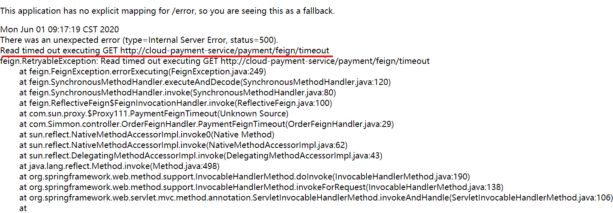

`openfeign底层ribbon默认调用服务返回1s超时即报错`

解决:

在80端口中的application.yml中添加

```yaml
ribbon:
  #建立连接所用的时间,适用于网络正常的情况下,两端连接所用的时间
  ReadTimeout: 5000
  #指的是建立连接后从服务器读取可用资源所用的时间
  ConnectTimeout: 5000
```

`yml可能不会提示这两种方法,但是这两种方法是有的,不会报错`

### openfeign日志增强

>`NONE`:  默认的,不会有任何日志信息
>
>`BASIC`:  仅记录请求方法,URL,响应装代码及执行时间
>
>`HEADERS`:  除了BASIC中的定义信息之外,还有请求和响应的都信息
>
>`FULL`:  除了HEADERS中定义的信息之外,还有请求和响应的正文及元素表格

在80端口下新建包和class文件

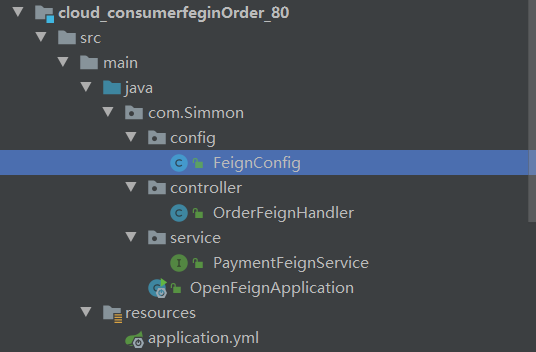

FeignConfig.class

```java
@Configuration
public class FeignConfig {
    @Bean
    Logger.Level feignLoggerLevel(){
        return Logger.Level.FULL;
    }
}
```

application.yml中添加

```yaml
logging:
  level:
    #feign日志监控那个接口,以什么形式打印日志
    com.Simmon.service.PaymentFeignService: debug
```

运行后后台就会打印你调用的方法即返回数据如:

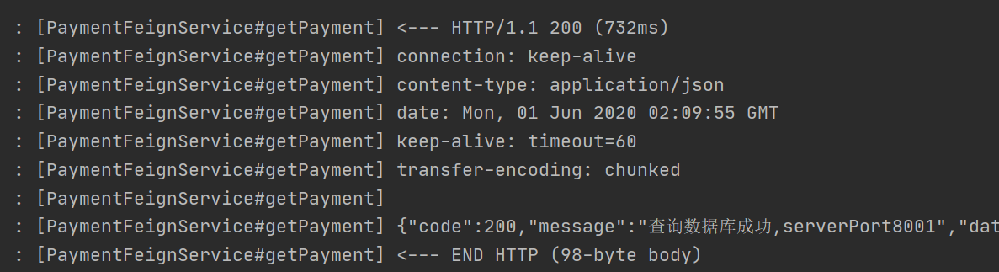

## 3. Hystrix

>`这里解释一下因为停更了,但是这个框架很优秀所以可以了解`
>
>服务降级(fallback),服务熔断(break),服务限流(flowlimit)-----简单来说当一个服务调用出现异常,超时等Hystrix可以避免此问题预防整个服务器出现`扇出效应`

>服务降级: 程序异常,超时,服务熔断触发服务降级,线程池/信号量打满也会导致服务降级
>
>服务熔断: 服务异常关闭无法访问该服务但是不会影响其他服务
>
>服务限流: 限制高并发操作必须依次运行

创建子工程8001

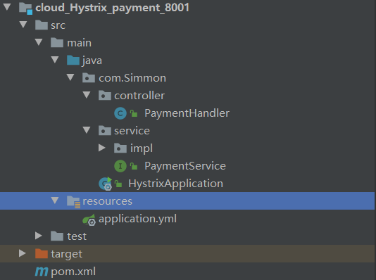

将eureka改为单机模式

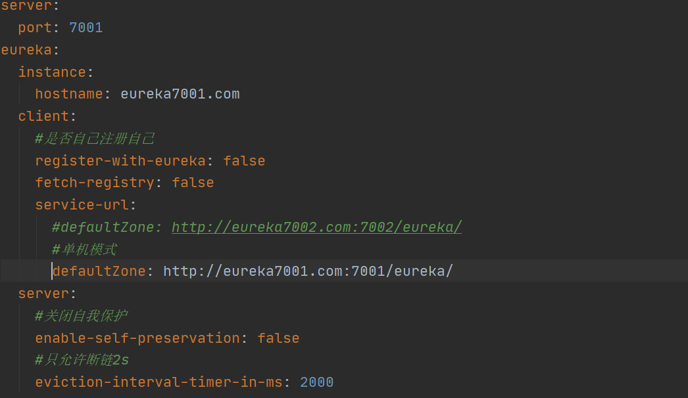

pom.xml

```xml
<dependencies>
    	<!--自己的包-->
        <dependency>
            <groupId>com.Simmon</groupId>
            <artifactId>cloud_api</artifactId>
            <version>1.0-SNAPSHOT</version>
        </dependency>
    
        <dependency>
            <groupId>org.springframework.boot</groupId>
            <artifactId>spring-boot-starter-web</artifactId>
        </dependency>
        <!--监控-->
        <dependency>
            <groupId>org.springframework.boot</groupId>
            <artifactId>spring-boot-starter-actuator</artifactId>
        </dependency>
        <!-- hystrix-->
        <dependency>
            <groupId>org.springframework.cloud</groupId>
            <artifactId>spring-cloud-starter-netflix-hystrix</artifactId>
        </dependency>
        <!--eureka client-->
        <dependency>
            <groupId>org.springframework.cloud</groupId>
            <artifactId>spring-cloud-starter-netflix-eureka-client</artifactId>
        </dependency>
        <!--热部署-->
        <dependency>
            <groupId>org.springframework.boot</groupId>
            <artifactId>spring-boot-devtools</artifactId>
            <scope>runtime</scope>
            <optional>true</optional>
        </dependency>
        <dependency>
            <groupId>org.projectlombok</groupId>
            <artifactId>lombok</artifactId>
            <optional>true</optional>
        </dependency>
        <dependency>
            <groupId>org.springframework.boot</groupId>
            <artifactId>spring-boot-starter-test</artifactId>
            <scope>test</scope>
        </dependency>
    </dependencies>
```

application.yml

```yaml
server:
  port: 8001
spring:
  application:
    name: cloud-hystrix-payment
eureka:
  client:
    service-url:
      defaultZone: http://localhost:7001/eureka
      #defaultZone: http://eureka7001.com:7001/eureka,http://eureka7002.com:7002/eureka
    register-with-eureka: true
    fetch-registry: true
```

PaymentService.interface

```java
public interface PaymentService {
    public String paymentInfo(Integer id);
    public String Timeout(Integer time);
}
```

PaymentServiceImpl.class

```java
@Service
public class PaymentServiceImpl implements PaymentService
{
    public String paymentInfo(Integer id) {
        return "线程池"+Thread.currentThread().getName()+"paymentInfo,id"+id+"\t"+"成功";
    }

    public String Timeout(Integer id) {

        int timeNum=3;
        try {
            TimeUnit.SECONDS.sleep(timeNum);
        } catch (InterruptedException e) {
            e.printStackTrace();
        }
        return "线程池"+Thread.currentThread().getName()+"Timeout,id"+id+"\t"+"哦豁"+"耗时"+timeNum+"秒";
    }
}
```

PaymentHandler.class

```java
@RestController
@Slf4j
@RequestMapping("/payment")
public class PaymentHandler {
    @Autowired
    private PaymentService paymentService;

    @Value("${server.port}")
    private String port;

    @GetMapping("/hystrix/paymentInfo/{id}")
    public String PaymentInfo(@PathVariable("id") Integer id){
        String result=paymentService.paymentInfo(id);
        log.info("*****result:"+result);
        return result;
    }

    @GetMapping("/hystrix/timeout/{id}")
    public String TimeOut(@PathVariable("id") Integer id){
        String result=paymentService.Timeout(id);
        log.info("*****result:"+result);
        return result;
    }
}
```

启动类

```java
@SpringBootApplication
@EnableEurekaClient
public class HystrixApplication {
    public static void main(String[] args) {
        SpringApplication.run(HystrixApplication.class,args);
    }
}
```

>这里可以通过`jemter`测试利用高并发来拖慢速度
>
>tomcat的线程数是10我们用20000的并发量去浏览,将会出现卡顿

这里是服务提供者一班不会主动访问所以创建一个消费者

1.创建子工程module

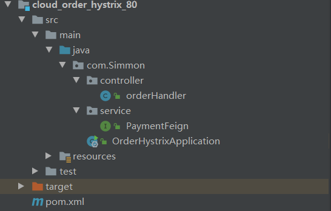

2.pom.xml

```xml
<dependencies>
        <dependency>
            <groupId>com.Simmon</groupId>
            <artifactId>cloud_api</artifactId>
            <version>1.0-SNAPSHOT</version>
        </dependency>
        
        <dependency>
            <groupId>org.springframework.boot</groupId>
            <artifactId>spring-boot-starter-web</artifactId>
        </dependency>
        <!-- openfeign -->
        <dependency>
            <groupId>org.springframework.cloud</groupId>
            <artifactId>spring-cloud-starter-openfeign</artifactId>
        </dependency>
        <!--监控-->
        <dependency>
            <groupId>org.springframework.boot</groupId>
            <artifactId>spring-boot-starter-actuator</artifactId>
        </dependency>
        <dependency>
            <groupId>org.springframework.cloud</groupId>
            <artifactId>spring-cloud-starter-netflix-hystrix</artifactId>
        </dependency>
        <!--eureka client-->
        <dependency>
            <groupId>org.springframework.cloud</groupId>
            <artifactId>spring-cloud-starter-netflix-eureka-client</artifactId>
        </dependency>
        <!--热部署-->
        <dependency>
            <groupId>org.springframework.boot</groupId>
            <artifactId>spring-boot-devtools</artifactId>
            <scope>runtime</scope>
            <optional>true</optional>
        </dependency>
        <dependency>
            <groupId>org.projectlombok</groupId>
            <artifactId>lombok</artifactId>
            <optional>true</optional>
        </dependency>
        <dependency>
            <groupId>org.springframework.boot</groupId>
            <artifactId>spring-boot-starter-test</artifactId>
            <scope>test</scope>
        </dependency>
    </dependencies>
```

application.yml

```yaml
server:
  port: 80
eureka:
  client:
    register-with-eureka: false
    service-url:
      defaultZone: http://localhost:7001/eureka
```

启动类

```java
@SpringBootApplication
@EnableFeignClients
public class OrderHystrixApplication {
    public static void main(String[] args) {
        SpringApplication.run(OrderHystrixApplication.class,args);
    }
}
```

service

paymentFegin.interface

````java
@Component
@FeignClient(value = "cloud-hystrix-payment")
public interface PaymentFeign {
    @GetMapping("/payment/hystrix/paymentInfo/{id}")
    public String PaymentInfo(@PathVariable("id") Integer id);
    @GetMapping("/payment/hystrix/timeout/{id}")
    public String TimeOut(@PathVariable("id") Integer id);
}
````

controller

orderHandler.class

```java
@RestController
@RequestMapping("/order")
@Slf4j
public class orderHandler {

    @Autowired
    private PaymentFeign paymentFeign;

    @GetMapping("/hystrix/paymentInfo/{id}")
    public String PaymentInfo(@PathVariable("id") Integer id){
        String result=paymentFeign.PaymentInfo(id);
        log.info("*****result:"+result);
        return result;
    }

    @GetMapping("/hystrix/timeout/{id}")
    public String TimeOut(@PathVariable("id") Integer id){
        String result=paymentFeign.TimeOut(id);
        log.info("*****result:"+result);
        return result;
    }
}
```

### 服务降级

1.在8001端口(超时)

service中的方法添加容错

```java
 @HystrixCommand(fallbackMethod = "TimeoutHandler",commandProperties = {@HystrixProperty(name="execution.isolation.thread.timeoutInMilliseconds",value = "3000")})
    public String Timeout(Integer id) {
        int timeNum=5;
        try {
            TimeUnit.SECONDS.sleep(timeNum);
        } catch (InterruptedException e) {
            e.printStackTrace();
        }
        return "线程池"+Thread.currentThread().getName()+"Timeout,id"+id+"\t"+"哦豁"+"耗时"+timeNum+"秒";
    }

    public String TimeoutHandler(Integer id){
        return "线程池"+Thread.currentThread().getName()+"TimeOutHandler,id:"+id+"哦豁找不到咯";
    }
```

>解释一下:
>
>​	`@HystrixCommand`-----这里是用注解的方式使用hystrix,原本是继承
>
>​	`fallbackMethod`-----当下面方法出现运行报错时,寻找后面的降级方法:
>
>​	意思就是:拿上面的来讲,当TimeOut这个方法报错时他会去寻找TimeoutHandler
>
>​	`commandProperties`----继续添加容错机制
>
>​	后面的意思就显而易见了意思就是当服务器响应超过三秒将会执行TimeoutHandler方法
>
>​	而这里我们设置线程睡眠5s所以结果是必然的

启动类加上注解

```java
@EnableCircuitBreaker
```

2.下面是80服务的降级

>嗯...这里说一下吧,我们做降级服务一般是返回给客户端的做降级,简单来说就是消费者做降级服务

orderHandler.class添加

```java
 @HystrixCommand(fallbackMethod = "TimeOutHandler",commandProperties = {@HystrixProperty(name= "execution.isolation.thread.timeoutInMilliseconds",value = "1500") })
    public String TimeOut(@PathVariable("id") Integer id){
        String result=paymentFeign.TimeOut(id);
        log.info("*****result:"+result);
        return result;
    }

    public String TimeOutHandler(@PathVariable("id") Integer id){
        return "哦豁报错咯"+id;
    }
```

启动类添加

```java
@EnableHystrix
```

application.yml添加

```yaml
feign:
  hystrix:
    enabled: true
```

3.添加默认降级方法减少容错

在80中的controller.orderHandler

```java
/*这是默认的服务降级*/
public String PaymentFallBack(){
    return "Global异常处理信息,请稍后重试";
}
```

头部要加上这个注解

```java
@DefaultProperties(defaultFallback = "PaymentFallBack")
```

如果要给这个方法一个降级默认处理需要加上这个

```java
@HystrixCommand
```

4.有关服务宕机的降级操作

在80中的service中


PaymenFeignService.class

```java
@Component
public class PaymentFeignService implements PaymentFeign {
    public String PaymentInfo(Integer id) {
        return "paymentFeign fall back paymentInfo";
    }

    public String TimeOut(Integer id) {
        return "paymentFeign fall back paymentTimeout";
    }
}
```

然后PaymenFeign.interface加上fallback

```java
@FeignClient(value = "cloud-hystrix-payment",fallback = PaymentFeignService.class)
```

测试

>* 当端口成功访问时然后停掉提供者的服务服务将会返回你重写的方法里的内容

提示:

>* 该方法只能用于服务宕机,如果代码出现问题他不会返回你给予的友好提示

### 服务熔断

>简介: 服务的降级--->进而熔断--->恢复调用链路
>
>当扇出链路的某个微服务出现不可用或者响应时间过长时,会进行服务降级,进而熔断该节点微服务的调用,快速返回错误的响应信息
>
>当检测到该节点微服务调用响应正常后,恢复调用链路.

在8001端口的serviceImpl加上(记着写接口哦)

```java
/*服务熔断*/
    @HystrixCommand(fallbackMethod = "paymentCircuitBreakerFallBack",commandProperties = {
            @HystrixProperty(name="circuitBreaker.enabled",value = "true"),//是否开启断路器
            @HystrixProperty(name="circuitBreaker.requestVolumeThreshold",value = "10"),//请求次数
            @HystrixProperty(name = "circuitBreaker.sleepWindowInMilliseconds",value = "10000"),//时间范围
            @HystrixProperty(name = "circuitBreaker.errorThresholdPercentage",value = "60")//失败率达到多少后熔断
    })
    public String paymentCircuitBreaker(Integer id){
        if (id<0){
            throw new RuntimeException("*****id 不能为负数");
        }
        String serialNumber = IdUtil.simpleUUID();/*UUID.randomUUID().toString();*/
        return Thread.currentThread().getName()+"\t"+"调用成功,流水号"+serialNumber;
    }

    public String paymentCircuitBreakerFallBack(Integer id){
        return "id 不能为负数,请稍后重试!!!-----id:"+id;
    }
```

controller中的Handler加上

```java
/*服务熔断*/
    @GetMapping("/hystrix/circuit/{id}")
    public String paymentCircuitBreaker(@PathVariable("id") Integer id){
        String result=paymentService.paymentCircuitBreaker(id);
        log.info("*****result"+result);
        return result;
    }
```

测试结果

>启动服务,然后成功访问,好的我们将请求的id值变为负数请求将会断路(这里的是访问10次失败率达到60%的时候断路)----->当断路时即使id值为正返回的依然是fallback信息,只有当第一次失败的时间间隔达到10s后尝试通过服务看是否为true,如果还是false继续关闭该服务

### hystrixDashboard(服务监控)

创建子工程(9001)

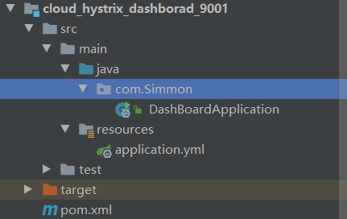

pom.xml

````xml
<dependencies>
        <dependency><!-- 引用自己定义的api通用包，可以使用Payment支付Entity -->
            <groupId>com.Simmon</groupId>
            <artifactId>cloud_consumerfeginOrder_80</artifactId>
            <version>1.0-SNAPSHOT</version>
        </dependency>
        <dependency>
            <groupId>org.springframework.boot</groupId>
            <artifactId>spring-boot-starter-web</artifactId>
        </dependency>
        <dependency>
            <groupId>org.springframework.cloud</groupId>
            <artifactId>spring-cloud-starter-netflix-hystrix-dashboard</artifactId>
        </dependency>
        <!--监控-->
        <dependency>
            <groupId>org.springframework.boot</groupId>
            <artifactId>spring-boot-starter-actuator</artifactId>
        </dependency>
        <dependency>
            <groupId>org.springframework.cloud</groupId>
            <artifactId>spring-cloud-starter-netflix-hystrix</artifactId>
        </dependency>
        <!--eureka client-->
        <dependency>
            <groupId>org.springframework.cloud</groupId>
            <artifactId>spring-cloud-starter-netflix-eureka-client</artifactId>
        </dependency>
        <!--热部署-->
        <dependency>
            <groupId>org.springframework.boot</groupId>
            <artifactId>spring-boot-devtools</artifactId>
            <scope>runtime</scope>
            <optional>true</optional>
        </dependency>
        <dependency>
            <groupId>org.projectlombok</groupId>
            <artifactId>lombok</artifactId>
            <optional>true</optional>
        </dependency>
        <dependency>
            <groupId>org.springframework.boot</groupId>
            <artifactId>spring-boot-starter-test</artifactId>
            <scope>test</scope>
        </dependency>
    </dependencies>
````

application.yml

```yaml
server:
  port: 9001
```

启动类

````java
@SpringBootApplication
@EnableHystrixDashboard
public class DashBoardApplication {
    public static void main(String[] args) {
        SpringApplication.run(DashBoardApplication.class,args);
    }
}
````

将需要监控的服务中的启动类里加上

```java
@Bean
    public ServletRegistrationBean getServlet(){
        HystrixMetricsStreamServlet streamServlet=new HystrixMetricsStreamServlet();
        ServletRegistrationBean registrationBean=new ServletRegistrationBean(streamServlet);
        registrationBean.setLoadOnStartup(1);
        registrationBean.addUrlMappings("/hystrix.stream");
        registrationBean.setName("HystrixMetricsStreamServlet");
        return registrationBean;
    }
```

>当然该启动类必须有这个注解`@EnableCircuitBreaker`

# 8. 服务网关:milky_way:

## 1.Gateway

>Route(路由):网关的基本模块,它由ID目标URI,一系列的断言和过滤器组成,如果断言为true则匹配该路由
>
>Predicate(断言):开发人员可以匹配HTTP请求中的内容,`如果请求与断言相匹配则进行路由`
>
>Filter(过滤):使用过滤器,可以在请求被路由前或者之后对请求进行修改

创建module工程cloud_gateway_9527

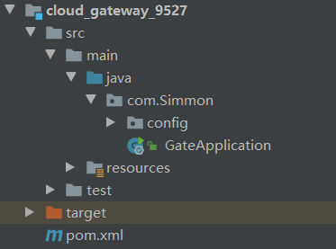

pom.xml

```xml
<dependencies>
        <dependency><!-- 引用自己定义的api通用包，可以使用Payment支付Entity -->
            <groupId>com.Simmon</groupId>
            <artifactId>cloud_api</artifactId>
            <version>1.0-SNAPSHOT</version>
        </dependency>
        <!--gateway-->
        <dependency>
            <groupId>org.springframework.cloud</groupId>
            <artifactId>spring-cloud-starter-gateway</artifactId>
        </dependency>
        <!--eureka client-->
        <dependency>
            <groupId>org.springframework.cloud</groupId>
            <artifactId>spring-cloud-starter-netflix-eureka-client</artifactId>
        </dependency>
        <!--热部署-->
        <dependency>
            <groupId>org.springframework.boot</groupId>
            <artifactId>spring-boot-devtools</artifactId>
            <scope>runtime</scope>
            <optional>true</optional>
        </dependency>
        <dependency>
            <groupId>org.projectlombok</groupId>
            <artifactId>lombok</artifactId>
            <optional>true</optional>
        </dependency>
        <dependency>
            <groupId>org.springframework.boot</groupId>
            <artifactId>spring-boot-starter-test</artifactId>
            <scope>test</scope>
        </dependency>
    </dependencies>
```

application.yml

```yaml
server:
  port: 9527
spring:
  application:
    name: cloud-gateway
  cloud:
    gateway:
      routes:
        - id: payment_routh #路由id,没有固定规则但要求唯一
          uri: http://localhost:8001 #匹配后提供服务的路由地址
          predicates:
            - Path=/payment/getPaymentById/** #断言,路径相匹配的进行路由

        - id: payment_rouyh2
          uri: http://localhost:8001
          predicates:
            - Path=/payment/lb/**
eureka:
  instance:
    hostname: cloud-gateway-service
  client:
    register-with-eureka: true
    fetch-registry: true
    service-url:
      defaultZone: http://eureka7001.com:7001/eureka
```

说明

>这里面`id`--->是自定义把它当成mysql中的主键
>
>这里的`uri`--->连接服务地址(这里我用的原来的8001)
>
>这里的`predicates -Path`--->连接原有服务的地址以便拼接在该网关的端口

启动类

```java
@SpringBootApplication
@EnableEurekaClient
public class GateApplication {
    public static void main(String[] args) {
        SpringApplication.run(GateApplication.class,args);
    }
}
```

测试

>这里启动eureka,8001,9527
>
>* 然后浏览器输入这个`localhost:9527/payment/getPaymentById/1`==(注意你拼接上的一定是你自己的地址也就是8001的地址)==

方法二用`@Bean`实现

config包中创建一个GatewayConfig.class

```java
@Configuration
public class GatewayConfig {
    @Bean
    public RouteLocator GateWayLocator(RouteLocatorBuilder routeLocatorBuilder){
        RouteLocatorBuilder.Builder routes=routeLocatorBuilder.routes();
        routes.route("Path_router",
                r -> r.path("/guonei").uri("http://news.baidu.com/guonei")).build();
        return routes.build();
    }
}
```

说明

>这里我选择的百度新闻
>
>`path`--->
>
>`uri`--->获取目标路径
>
>`"Path_router"`--->为这个命名相当于yml中的id
>
>这里用的lambda表达式

### Dynamic routing(动态路由)

9527服务中的application.yml

```yaml
server:
  port: 9527
spring:
  application:
    name: cloud-gateway
  cloud:
    gateway:
      discovery:
        locator:
          enabled: true #开启注册中心动态创建路由的功能,利用微服务名进行路由
      routes:
        - id: payment_routh #路由id,没有固定规则但要求唯一
          uri: lb://cloud-payment-service #匹配后提供服务的路由地址
          predicates:
            - Path=/payment/getPaymentById/** #断言,路径相匹配的进行路由

        - id: payment_rouyh2
          uri: lb://cloud-payment-service
          predicates:
            - Path=/payment/lb/**
eureka:
  instance:
    hostname: cloud-gateway-service
  client:
    register-with-eureka: true
    fetch-registry: true
    service-url:
      defaultZone: http://eureka7001.com:7001/eureka
```

启动8001和8002服务

测试

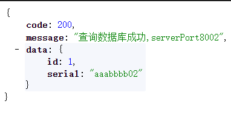

or

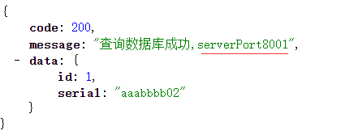

>自动实现负载均衡

### Predicate Factories(断言)

>```
>- After=2020-06-06T14:12:28.896+08:00[Asia/Shanghai]
>```
>
>- 这个表示在这个时间之后可以访问 -Path(如果没有在该时段进行访问则返回404错误)
>
>```yaml
>- Before=2020-06-06T14:12:28.896+08:00[Asia/Shanghai]
>```
>
>- 这个表示在这个之间之前访问 -Path
>
>```yaml
>- Between=2020-06-06T14:12:28.896+08:00[Asia/Shanghai],2020-06-06T19:12:28.896+08:00[Asia/Shanghai]
>```
>
>- 只能在这个时间段之间进行访问
>
>```yaml
>- Cookie=username,11496
>```
>
>- 测试
>
>  开启cmd窗口
>
>  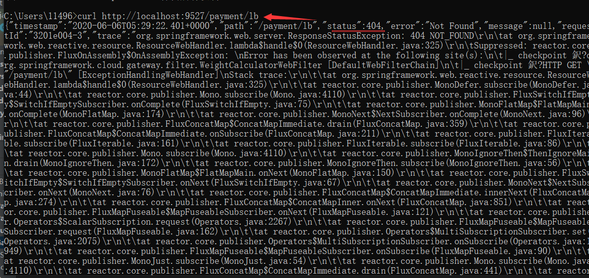
>
>  不带cookie访问返回404
>
>  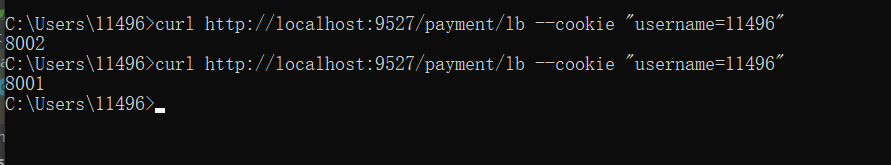
>
>  带cookie访问
>
>  
>
>  `Header`属性
>
>  ```yaml
>  - Header=X-Request-Id,\d+ #请求头要为X-Request-Id而且请求数据必须是整数的正则表达式
>  ```
>
>  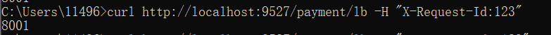
>
>  错误的
>
>  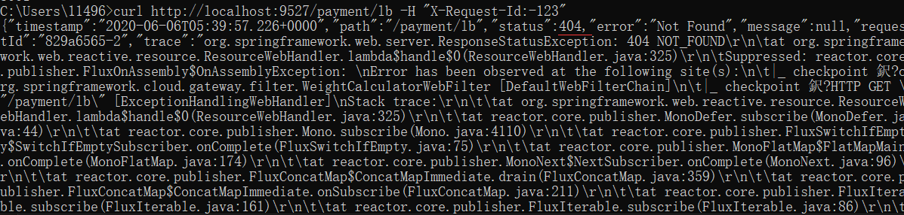
>
>```yaml
>- Method=GET
>```
>
>- 请求方式GET

### Filter(过滤器)

在9527下创建filter包

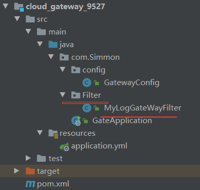


MyLogGateWayFilter

```java
@Component
@Slf4j
public class MyLogGateWayFilter implements GlobalFilter, Ordered {
    @Override
    public Mono<Void> filter(ServerWebExchange exchange, GatewayFilterChain chain) {
        log.info("**********come in Log*********"+new Date());
        String uname=exchange.getRequest().getQueryParams().getFirst("uname");
        if(uname == null){
            log.info("*****用户名为null,不能通过");
            exchange.getResponse().setStatusCode(HttpStatus.NOT_ACCEPTABLE);
            return exchange.getResponse().setComplete();
        }
        return chain.filter(exchange);
    }

    @Override
    public int getOrder() {
        return 0;
    }
}
```

>这里是全局过滤器
>
>- ==访问端口号时需要加一个?uname='?'==

# 6.服务配置:confetti_ball:

## 1.Config

>集中管理配置文件

#### 1. 全局配置

创建3344项目


pom.xml

```xml
<dependencies>
        <!--config server-->
        <dependency>
            <groupId>org.springframework.cloud</groupId>
            <artifactId>spring-cloud-config-server</artifactId>
        </dependency>
        <!-- 添加消息总线RabbitMQ支持 -->
        <dependency>
            <groupId>com.Simmon</groupId>
            <artifactId>cloud_api</artifactId>
            <version>1.0-SNAPSHOT</version>
        </dependency>
        <dependency>
            <groupId>org.springframework.boot</groupId>
            <artifactId>spring-boot-starter-web</artifactId>
        </dependency>
        <!--监控-->
        <dependency>
            <groupId>org.springframework.boot</groupId>
            <artifactId>spring-boot-starter-actuator</artifactId>
        </dependency>
        <!--eureka client-->
        <dependency>
            <groupId>org.springframework.cloud</groupId>
            <artifactId>spring-cloud-starter-netflix-eureka-client</artifactId>
        </dependency>
        <!--热部署-->
        <dependency>
            <groupId>org.springframework.boot</groupId>
            <artifactId>spring-boot-devtools</artifactId>
            <scope>runtime</scope>
            <optional>true</optional>
        </dependency>
        <dependency>
            <groupId>org.projectlombok</groupId>
            <artifactId>lombok</artifactId>
            <optional>true</optional>
        </dependency>
        <dependency>
            <groupId>org.springframework.boot</groupId>
            <artifactId>spring-boot-starter-test</artifactId>
            <scope>test</scope>
        </dependency>
    </dependencies>
```

application.yml

```yaml
server:
  port: 3344
spring:
  application:
    name: cloud-config-center
  cloud:
    config:
      server:
        git:
        #这里是你创建的github地址
          uri: https://github.com/Simmon-Lon/springcloud-config.git
          search-paths:
            - springcloud-config
      label: master
eureka:
  client:
    service-url:
      defaultZone: http://localhost:7001/eureka
```

configApplication.class

```java
@SpringBootApplication
@EnableConfigServer
public class ConfigApplication {
    public static void main(String[] args) {
        SpringApplication.run(ConfigApplication.class,args);
    }
}
```

>关于git远程仓库
>
>1. 创建一个新的仓库名字为springcloud-config(`一定要是公开的哦`)
>
>   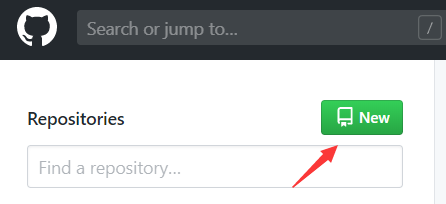
>
>   

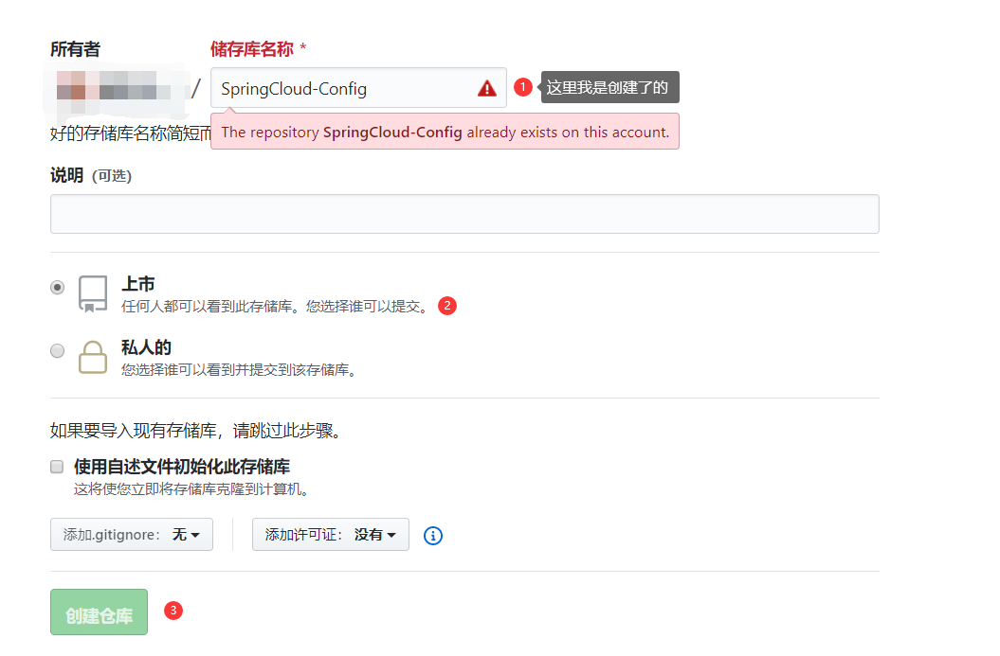

然后用git Bash Here

>git clone https://github.com/Simmon-Lon/springcloud-config.git  -----下载到你的文件下面(`记住一定要去下载一个git`)
>
>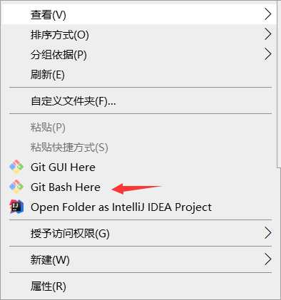
>
>==然后将下载的文件提交到你的仓库里或者你直接去我的仓库克隆==

2.配置host文件

>`路径`-----C:\Windows\System32\drivers\etc

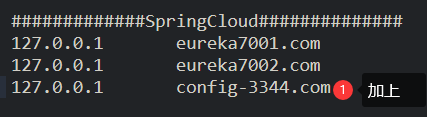

最后启动服务访问就ok了

>如:---http://config-3344.com:3344/master/config-dev.yml

#### 2. 客服端配置

创建新的子工程3355

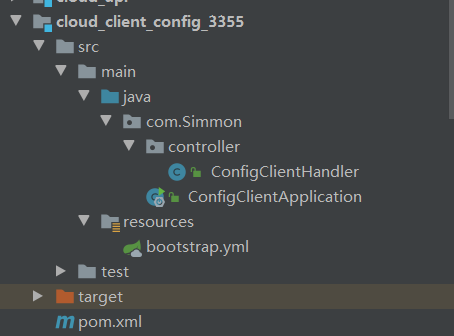

pom.xml

```xml
<dependencies>
        <dependency>
            <groupId>org.springframework.cloud</groupId>
            <artifactId>spring-cloud-starter-config</artifactId>
        </dependency>
        <dependency><!-- 引用自己定义的api通用包，可以使用Payment支付Entity -->
            <groupId>com.Simmon</groupId>
            <artifactId>cloud_api</artifactId>
            <version>1.0-SNAPSHOT</version>
        </dependency>
        <dependency>
            <groupId>org.springframework.boot</groupId>
            <artifactId>spring-boot-starter-web</artifactId>
        </dependency>
        <!--监控-->
        <dependency>
            <groupId>org.springframework.boot</groupId>
            <artifactId>spring-boot-starter-actuator</artifactId>
        </dependency>
        <!--eureka client-->
        <dependency>
            <groupId>org.springframework.cloud</groupId>
            <artifactId>spring-cloud-starter-netflix-eureka-client</artifactId>
        </dependency>
        <!--热部署-->
        <dependency>
            <groupId>org.springframework.boot</groupId>
            <artifactId>spring-boot-devtools</artifactId>
            <scope>runtime</scope>
            <optional>true</optional>
        </dependency>
        <dependency>
            <groupId>org.projectlombok</groupId>
            <artifactId>lombok</artifactId>
            <optional>true</optional>
        </dependency>
        <dependency>
            <groupId>org.springframework.boot</groupId>
            <artifactId>spring-boot-starter-test</artifactId>
            <scope>test</scope>
        </dependency>
    </dependencies>
```

bootstrap.yml

```yaml
server:
  port: 3355
spring:
  application:
    name: config-client
  cloud:
    config:
      label: master
      name: config
      profile: dev
      uri: http://localhost:3344
eureka:
  client:
    service-url:
      defaultZone: http://localhost:7001/eureka
```

>==说明==
>
>​	这里的bootstrap.yml的优先级是要高于application.yml
>
>​	这里是通过客服端的bootstrap先扫描用它来约束application
>
>​	`这里就是去找master分支下的config-dev,yml`

启动类

```java
@SpringBootApplication
@EnableEurekaClient
public class ConfigClientApplication {
    public static void main(String[] args) {
        SpringApplication.run(ConfigClientApplication.class,args);
    }
}
```

controller.handler

```java
@RestController
public class ConfigClientHandler {
    @Value("${config.info}")
    private String configInfo;

    @GetMapping("/configInfo")
    public String getConfigInfo(){
        return configInfo;
    }
}
```

>测试:
>
>这里通过http://localhost:3355/configInfo来访问3344中的config-dev.yml文件

手动刷新客服端3355

>这里是什么意思?
>
>​	当我们修改github中的文件3344更新而3355不更新
>
>​	所以我们手动刷新两种方法

1. 3355bootstrap.yml添加

   ==注意==:`在Spring Boot升级到2.0.3.RELEASE后需新增配置`(这个方法)

   ```yaml
   #暴露监控端点
   management:
     endpoints:
       web:
         exposure:
           include: "*"
   ```

   controller.handler添加

   ```java
   @RefreshScope
   ```

进入cmd执行

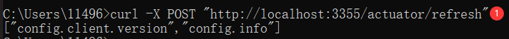

就可以实现手动刷新了`这里一定要post请求哦`

2. ==注意==:这个方法在高版本的springboot中已经被弃用

   ```yaml
   #动态刷新配置 ---需要忽略权限拦截
   management:
   	security:
   		enabled: false
   ```

3. 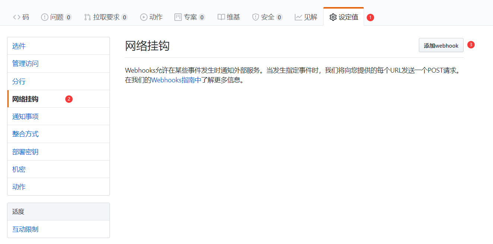

还是发==post==请求,请求路径`自定义`

# 7.服务总线:bus:

## 1. BUS

>支持两种消息代理: RabbitMQ和Kafka

下载[Erlang](https://www.erlang.org/downloads/23.0)[^点击这里],[RabbitMQ](https://github.com/rabbitmq/rabbitmq-server/tags)[^ 点击这里]

RabbitMQ安装后进入sbin目录通过cmd运行

>rabbitmq-plugins enable rabbitmq_management

检查是否安装成功

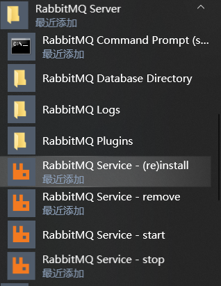

浏览器运行http://localhost:15672

>初始的:
>
>- 账号:`guest` 密码:`guest`

### 动态刷新

创建3366

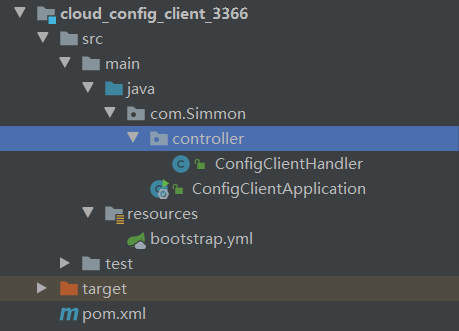

pom.xml

```xml
	<dependencies>
        <dependency>
            <groupId>org.springframework.cloud</groupId>
            <artifactId>spring-cloud-starter-config</artifactId>
        </dependency>
        <dependency>
            <groupId>org.springframework.cloud</groupId>
            <artifactId>spring-cloud-starter-bus-amqp</artifactId>
        </dependency>
        <dependency><!-- 引用自己定义的api通用包，可以使用Payment支付Entity -->
            <groupId>com.Simmon</groupId>
            <artifactId>cloud_api</artifactId>
            <version>1.0-SNAPSHOT</version>
        </dependency>
        <dependency>
            <groupId>org.springframework.boot</groupId>
            <artifactId>spring-boot-starter-web</artifactId>
        </dependency>
        <!--监控-->
        <dependency>
            <groupId>org.springframework.boot</groupId>
            <artifactId>spring-boot-starter-actuator</artifactId>
        </dependency>
        <!--eureka client-->
        <dependency>
            <groupId>org.springframework.cloud</groupId>
            <artifactId>spring-cloud-starter-netflix-eureka-client</artifactId>
        </dependency>
        <!--热部署-->
        <dependency>
            <groupId>org.springframework.boot</groupId>
            <artifactId>spring-boot-devtools</artifactId>
            <scope>runtime</scope>
            <optional>true</optional>
        </dependency>
        <dependency>
            <groupId>org.projectlombok</groupId>
            <artifactId>lombok</artifactId>
            <optional>true</optional>
        </dependency>
        <dependency>
            <groupId>org.springframework.boot</groupId>
            <artifactId>spring-boot-starter-test</artifactId>
            <scope>test</scope>
        </dependency>
    </dependencies>
```

==注意==

> 在这里需要将上面3344,3355中添加这个依赖
>
> ```xml
> 		<dependency>
>             <groupId>org.springframework.cloud</groupId>
>             <artifactId>spring-cloud-starter-bus-amqp</artifactId>
>         </dependency>
> ```

bootstrap.yml

```yaml
server:
  port: 3366
spring:
  application:
    name: config-client
  cloud:
    config:
      label: master
      name: config
      profile: dev
      uri: http://localhost:3344
      
  #注意这里,配置rabbitmq
  rabbitmq:
    host: localhost
    port: 5672
    username: guest
    password: guest
eureka:
  client:
    service-url:
      defaultZone: http://localhost:7001/eureka
#暴露监控端点
management:
  endpoints:
    web:
      exposure:
        include: "*"
```

==注意==

>修改3344application.yml
>
>```yaml
>server:
>  port: 3344
>spring:
>  application:
>    name: cloud-config-center
>  cloud:
>    config:
>      server:
>        git:
>          uri: https://github.com/Simmon-Lon/springcloud-config.git
>          search-paths:
>            - springcloud-config
>      label: master
>  rabbitmq:
>    host: localhost
>    port: 5672
>    username: guest
>    password: guest
>eureka:
>  client:
>    service-url:
>      defaultZone: http://localhost:7001/eureka
>management:
>  endpoints:
>    web:
>      exposure:
>        include: 'bus-refresh'
>```
>
>修改3355bootstrap.yml
>
>```yaml
>server:
>  port: 3355
>spring:
>  application:
>    name: config-client
>  cloud:
>    config:
>      label: master
>      name: config
>      profile: dev
>      uri: http://localhost:3344
>  rabbitmq:
>    host: localhost
>    port: 5672
>    username: guest
>    password: guest
>eureka:
>  client:
>    service-url:
>      defaultZone: http://localhost:7001/eureka
>#暴露监控端点
>management:
>  endpoints:
>    web:
>      exposure:
>        include: "*"
>
>```

contreoller.handler

```java
@RestController
@RefreshScope
public class ConfigClientHandler {
    @Value("${config.info}")
    private String configInfo;

    @Value("${server.port}")
    private String serverPort;

    @GetMapping("/configInfo")
    public String getConfigInfo(){
        return "configInfo:"+configInfo+"\t"+"serverPort:"+serverPort;
    }
}

```

启动类

```java
@SpringBootApplication
@EnableEurekaClient
public class ConfigClientApplication {
    public static void main(String[] args) {
        SpringApplication.run(ConfigClientApplication.class,args);
    }
}
```

启动eureka,3344,3355,3366

通过修改github中的config-dev.yml实现3344服务端口向下广播其他服务实现刷新

1. 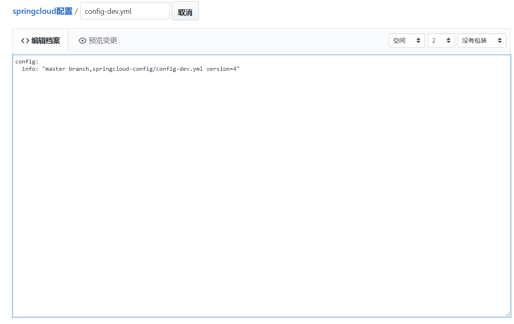

2. 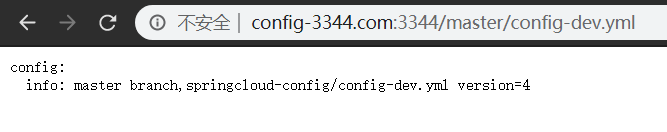

3. 

4. 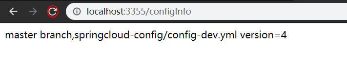

3366跟3355一样就不演示了

`完事!!!!`

>补充说明:
>
>- 如果你想只通知一个不想广播其他服务
>- cmd中运行---curl -X POST "http://localhost:3344/actuator/bus-refresh/config-client:3355"
>
>解释:
>
>3344--->configserver简单来说就是管理总的yml文件的服务端口号
>
>bus-refresh--->3344yml中的暴露监控端点的名称可自定义
>
>config-sclient:3355---->显而易见config-client就是注册进eureka的服务名称,3355服务端口号

## 2. Stream

>消息中间建的自动转换无需配置底层现在仅支持以下
>
>* `rabbitMQ`----->`kafuka`
>* `kafuka`----->`rabbitMQ`

创建生产者8801

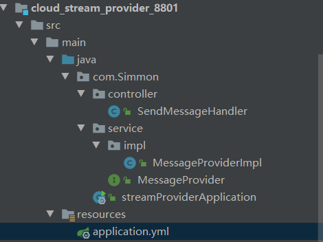

application.yml

```yaml
server:
  port: 8801
spring:
  application:
    name: cloud-stream-provider
  cloud:
    stream:
      binders: #一组rabbitMQ的连接信息
        defaultRabbit:
          type: rabbit
          environment:
            spring:
              rabbitmq:
                host: localhost
                port: 5672
                username: guest
                password: guest
      bindings: #声明输入和输出通道的接口集合
        output: #output、input，stream提供的默认生产者与消费者
          destination: studyExchange #destination要绑定的交换机，对应rabbitmq中的Exchanges
          content-type: application/json #设置消息类型此处为json,文档为text/plain
          default-binder: defaultRabbit #设置要绑定的消息服务的具体设置
eureka:
  client:
    service-url:
      defaultZone: http://localhost:7001/eureka
  instance:
    lease-renewal-interval-in-seconds: 2 #续约更新时间间隔（默认30秒)
    lease-expiration-duration-in-seconds: 5 # 续约到期时间（默认90秒）
    instance-id: send-8801.com #信息列表时显示主机名称
    prefer-ip-address: true #访问路径变为ip地址
```

启动类

```java
@SpringBootApplication
public class streamProviderApplication {
    public static void main(String[] args) {
        SpringApplication.run(streamProviderApplication.class,args);
    }
}
```

MessageProvider.interface

```java
public interface MessageProvider {
    public String send();
}
```

MessageProviderImpl.class

```java
@EnableBinding(Source.class)
@Slf4j
public class MessageProviderImpl implements MessageProvider {

    @Autowired
    private MessageChannel output; //消息发送管道

    public String send() {
        String serial= UUID.randomUUID().toString();
        output.send(MessageBuilder.withPayload(serial).build());
        log.info("*****serial*****"+serial);
        return null;
    }
}
```

SendMessageHandler.class

```java
@RestController
@RequestMapping("/stream")
public class SendMessageHandler {

    @Autowired
    private MessageProvider messageProvider;

    @GetMapping("/sendMessage")
    public String sendMessage(){
        return messageProvider.send();
    }
}
```

测试

>启动eureka,stream

登录RabbitMQ

[登录](localhost:15672)

密码和用户都是`guest`

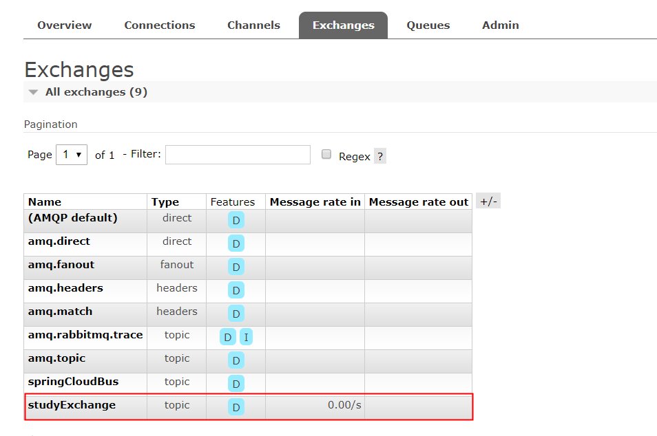

[访问](localhost:8801/stream/sendMessage)

后台

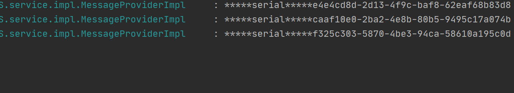

每刷新一次出现一次数据

试图`RabbitMQ`

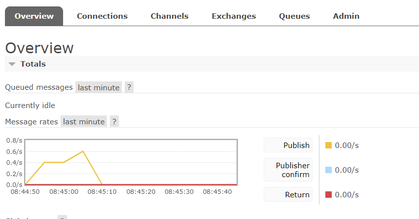

创建消费者8802

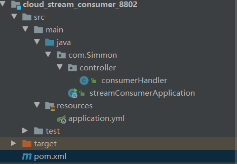

pom.xml

```xml
<dependencies>
        <dependency>
            <groupId>org.springframework.boot</groupId>
            <artifactId>spring-boot-starter-web</artifactId>
        </dependency>
        <!--监控-->
        <dependency>
            <groupId>org.springframework.boot</groupId>
            <artifactId>spring-boot-starter-actuator</artifactId>
        </dependency>
        <!--eureka client-->
        <dependency>
            <groupId>org.springframework.cloud</groupId>
            <artifactId>spring-cloud-starter-netflix-eureka-client</artifactId>
        </dependency>
        <!--stream rabbit -->
        <dependency>
            <groupId>org.springframework.cloud</groupId>
            <artifactId>spring-cloud-starter-stream-rabbit</artifactId>
        </dependency>
        <!--热部署-->
        <dependency>
            <groupId>org.springframework.boot</groupId>
            <artifactId>spring-boot-devtools</artifactId>
            <scope>runtime</scope>
            <optional>true</optional>
        </dependency>
        <dependency>
            <groupId>org.projectlombok</groupId>
            <artifactId>lombok</artifactId>
            <optional>true</optional>
        </dependency>
        <dependency>
            <groupId>org.springframework.boot</groupId>
            <artifactId>spring-boot-starter-test</artifactId>
            <scope>test</scope>
        </dependency>
    </dependencies>
```

application.yml

```yaml
server:
  port: 8802
spring:
  application:
    name: cloud-stream-consumer
  cloud:
    stream:
      binders:
        defaultRabbit:
          type: rabbit
          environment:
            spring:
              rabbitmq:
                host: localhost
                port: 5672
                username: guest
                password: guest
      bindings:
        input: #消费者
          destination: studyExchange
          content-type: application/json #设置消息类型此处为json,文档为text/plain
          default-binder: defaultRabbit #设置要绑定的消息服务的具体设置
eureka:
  client:
    service-url:
      defaultZone: http://localhost:7001/eureka
  instance:
    lease-renewal-interval-in-seconds: 2 #续约更新时间间隔（默认30秒)
    lease-expiration-duration-in-seconds: 5 # 续约到期时间（默认90秒）
    instance-id: send-8802.com #信息列表时显示主机名称
    prefer-ip-address: true #访问路径变为ip地址
```

controller.consumerHandler.class

```java
@Component
@EnableBinding(Sink.class)
public class consumerHandler {

    @Value("${server.port}")
    private String serverPort;

    @StreamListener(Sink.INPUT)
    public void input(Message<String> message){
        System.out.println("消费着一号,------>接收的消息:"+message.getPayload()+"\t"+"port:"+serverPort);
    }
}
```

启动类

```java
@SpringBootApplication
public class streamConsumerApplication {
    public static void main(String[] args) {
        SpringApplication.run(streamConsumerApplication.class,args);
    }
}
```

测试

>启动eureka,8801,8802
>
>调用8801----->8802将会接收8801响应的信息
>
>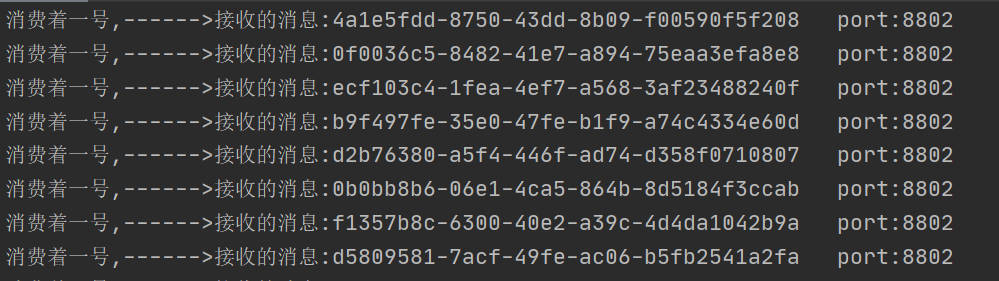

### 消息重复和持久化

创建一个跟8802一样的8803moudle

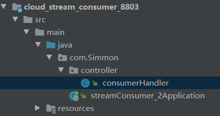

==配置都是一样的只需要改端口号==

运行的时候会发生两个消息插件都接收了生产者的信息重复了

解决....

向8802和8803application.yml加入`group:`

```yaml
server:
  port: 8802
spring:
  application:
    name: cloud-stream-consumer
  cloud:
    stream:
      binders:
        defaultRabbit:
          type: rabbit
          environment:
            spring:
              rabbitmq:
                host: localhost
                port: 5672
                username: guest
                password: guest
      bindings:
        input:
          destination: studyExchange
          content-type: application/json #设置消息类型此处为json,文档为text/plain
          default-binder: defaultRabbit #设置要绑定的消息服务的具体设置
          group: Simmon #自定义组名
eureka:
  client:
    service-url:
      defaultZone: http://localhost:7001/eureka
  instance:
    lease-renewal-interval-in-seconds: 2 #续约更新时间间隔（默认30秒)
    lease-expiration-duration-in-seconds: 5 # 续约到期时间（默认90秒）
    instance-id: send-8802.com #信息列表时显示主机名称
    prefer-ip-address: true #访问路径变为ip地址
```

==如果分组为同一个名称将只会有一个服务接收生产者返回的消息==

消息持久化

听掉8802,8803

`删除其中一个服务的group:`

测试:

>启动eureka,8801
>
>访问生产者
>
>在启动8802,8803
>
>删除group的将会报错
>
>而没有删除的将会访问之前我们访问的生产者的信息

## 3.Sleuth

>调用服务越来越长,将会发生超时,报错
>
>==查找链路的调用==

下载zipkin

[点这里](http://dl.bintray.com/openzipkin/maven/io/zipkin/java/zipkin-server/)下载zipkin

cmd运行zipkin[^在你下载后保存的地方]

>`java -jar zipkin-server-2.12.9-exec.jar`

运行这段话

>浏览器输入:`localhost:9411`

如果显示:

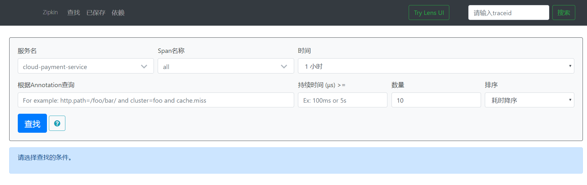

你就成功了!!!!!

具体:

用原来的cloud_order_80和cloud_pay_8001进行修改

8001

pom.xml加入

```xml
		<dependency>
            <groupId>org.springframework.cloud</groupId>
            <artifactId>spring-cloud-starter-zipkin</artifactId>
        </dependency>
```


application.yml

```yaml
server:
  port: 8001
spring:
  application:
    name: cloud-payment-service
  datasource:
    url: jdbc:mysql://localhost:3306/db2019?useUnicode=true&characterEncoding=UTF-8&serverTimezone=UTC&useSSL=false
    username: root
    password: 1234
    driver-class-name: org.gjt.mm.mysql.Driver
    type: com.alibaba.druid.pool.DruidDataSource
  zipkin:
    base-url: http://localhost:9411
  sleuth:
    sampler:
      probability: 1 #采样率值介于0到1之间,1表示全采集
mybatis:
  mapper-locations: classpath:/mapper/*.xml
  type-aliases-package: com.Simmon.entity
eureka:
  client:
    register-with-eureka: true
    fetch-registry: true
    service-url:
      defaultZone: http://localhost:7001/eureka
      #defaultZone: http://eureka7001.com:7001/eureka,http://eureka7002.com:7002/eureka
  instance:
    instance-id: payment8001
    prefer-ip-address: true
    #eureka客户端向服务端响应时间间隔,单位秒(默认30s)
    lease-renewal-interval-in-seconds: 1
    #eureka服务端在收到最后一次响应的时限,单位秒,超时将剔除服务(默认90s)
    lease-expiration-duration-in-seconds: 2
```

controller.paymentHandler添加

```java
	@GetMapping("/zipkin")
    public String paymentZipkin(){
        return "hello welcome zipkin RestTemple.";
    }
```

80服务

pom.xml添加

```xml
		<dependency>
            <groupId>org.springframework.cloud</groupId>
            <artifactId>spring-cloud-starter-zipkin</artifactId>
        </dependency>
```


application.yml

```yaml
server:
  port: 80
spring:
  application:
    name: cloud_order_service
  zipkin:
    base-url: http://localhost:9411
  sleuth:
    sampler:
      probability: 1 #采样率值介于0到1之间,1表示全采集
eureka:
  client:
    register-with-eureka: true
    fetch-registry: true
    service-url:
      defaultZone: http://localhost:7001/eureka
      #defaultZone: http://eureka7001.com:7001/eureka,http://eureka7002.com:7002/eureka
```

controller.orderHandler添加

```java
	@GetMapping("/payment/zipkin")
    public String paymentZipkin(){
        String result=restTemplate.getForObject("http://localhost:8001"+"/payment/zipkin",String.class);
        return result;
    }
```

测试:

>启动eureka,8001,80
>
>访问80中的`localhost/order/payment/zipkin`
>
>打开图形界面`localhost:9411`
>
>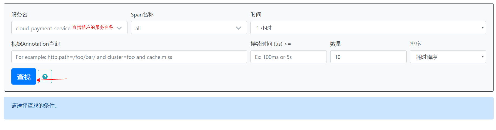
>
>可以看见服务调用几秒具体自己实验!!!!

# 8.SpringCloudAlibaba:star2:

## 1.Nacos

>Nocos=Eureka+config+Bus

安装nacos

[点击这里](https://github.com/alibaba/nacos/releases)==请按springcloud和maven,jdk选择版本具体请见[官方文档](https://nacos.io/zh-cn/docs/quick-start.html)==

下载之后解压进入bin文件下

通过cmd启动`startup.cmd`

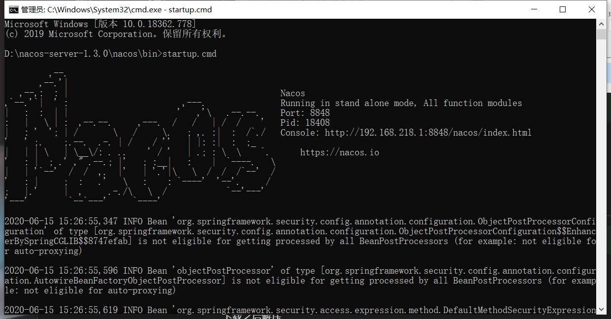

>访问:
>
>​	http://localhost:8848/nacos
>
>密码和用户默认都是`nacos`

### 1.负载均衡(rabbion[^继承了rabbion])

>这里提一下nacos支持所有模式AP或CP---->支持持久化和非持久化
>
>`CAP原则又称CAP定理，指的是在一个分布式系统中， Consistency（一致性）、 Availability（可用性）、Partition tolerance（分区容错性），三者不可得兼。`

1. 创建提供者两个9901,9002


==这里9001和9002是一样的我就演示一个==

pom.xml

```xml
	<dependencies>
        <dependency>
            <groupId>com.alibaba.cloud</groupId>
            <artifactId>spring-cloud-starter-alibaba-nacos-discovery</artifactId>
        </dependency>

        <dependency>
            <groupId>org.springframework.boot</groupId>
            <artifactId>spring-boot-starter-web</artifactId>
        </dependency>
        <dependency>
            <groupId>org.springframework.boot</groupId>
            <artifactId>spring-boot-starter-actuator</artifactId>
        </dependency>
        <!--热部署-->
        <dependency>
            <groupId>org.springframework.boot</groupId>
            <artifactId>spring-boot-devtools</artifactId>
            <scope>runtime</scope>
            <optional>true</optional>
        </dependency>
        <dependency>
            <groupId>org.projectlombok</groupId>
            <artifactId>lombok</artifactId>
            <optional>true</optional>
        </dependency>
        <dependency>
            <groupId>org.springframework.boot</groupId>
            <artifactId>spring-boot-starter-test</artifactId>
            <scope>test</scope>
        </dependency>
    </dependencies>

```

application.yml

```yaml
server:
  port: 9001
spring:
  application:
    name: nacos-payment-provider
  cloud:
    nacos:
      discovery:
        server-addr: localhost:8848
#暴露所有端点
management:
  endpoints:
    web:
      exposure:
        include: '*'
```

controller.*Handler.class

```java
@RestController
public class nacosHandler {

    @Value("${server.port}")
    private String serverPort;

    @GetMapping("/echo/{id}")
    public String echo(@PathVariable("id") String id){
        return "Hello Nacos Discovery "+id+"\t"+"端口号:"+serverPort;
    }
}
```

启动类

```java
@SpringBootApplication
@EnableDiscoveryClient
public class nacosApplication {
    public static void main(String[] args) {
        SpringApplication.run(nacosApplication.class,args);
    }
}
```

2. 创建消费者

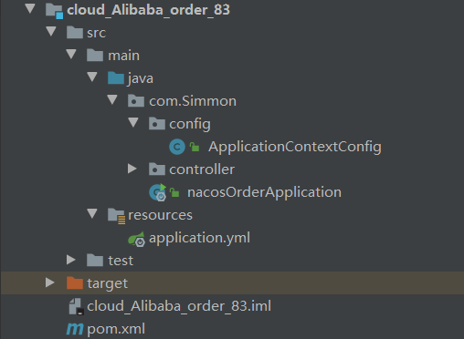

pom.xml

```xml
<dependencies>
        <dependency>
            <groupId>com.alibaba.cloud</groupId>
            <artifactId>spring-cloud-starter-alibaba-nacos-discovery</artifactId>
        </dependency>

        <dependency>
            <groupId>org.springframework.boot</groupId>
            <artifactId>spring-boot-starter-web</artifactId>
        </dependency>
        <dependency>
            <groupId>org.springframework.boot</groupId>
            <artifactId>spring-boot-starter-actuator</artifactId>
        </dependency>
        <!--热部署-->
        <dependency>
            <groupId>org.springframework.boot</groupId>
            <artifactId>spring-boot-devtools</artifactId>
            <scope>runtime</scope>
            <optional>true</optional>
        </dependency>
        <dependency>
            <groupId>org.projectlombok</groupId>
            <artifactId>lombok</artifactId>
            <optional>true</optional>
        </dependency>
        <dependency>
            <groupId>org.springframework.boot</groupId>
            <artifactId>spring-boot-starter-test</artifactId>
            <scope>test</scope>
        </dependency>
    </dependencies>
```

  application.yml

```yml
server:
  port: 83
spring:
  application:
    name: nacos-order-consumer
  cloud:
    nacos:
      discovery:
        server-addr: localhost:8848
#这里是将提供者写入yml
service-url:
  nacos-user-service: http://nacos-payment-provider
```

conrtroller.*Handler

```java
@RestController
@Slf4j
@RequestMapping("/payment")
public class OrderHandler {

    @Autowired
    private RestTemplate restTemplate;

    /*这里调用yml中的属性与serverPort相似*/
    @Value("${service-url.nacos-user-service}")
    private String serverURL;

    @GetMapping("/nacos/{id}")
    public String getPayment(@PathVariable("id") String id){
        return restTemplate.getForObject(serverURL+"/echo/"+id,String.class);
    }
}
```

config.*Config

```java
@Configuration
public class ApplicationContextConfig {
    @Bean
    @LoadBalanced
    public RestTemplate getResetTemplate(){
        return new RestTemplate();
    }
}
```

启动类

```java
@SpringBootApplication
@EnableDiscoveryClient
public class nacosOrderApplication {
    public static void main(String[] args) {
        SpringApplication.run(nacosOrderApplication.class,args);
    }
}
```

测试

>访问`localhost:83/payment/nacos/{id}`刷新出现serverport的轮询

### 2. 配置中心(config)

#### 1. DataId

关于从nacos拉取配置文件的规则---->**DataId**

>DataId=**${prefix}-${spring.profile.active}.${file-extension}**
>
>${prefix}默认为`spring.application.name`
>
>${spring.profile.active}为当前环境对应的profile
>
>${file-extension} 为文件数据格式

创建3377服务

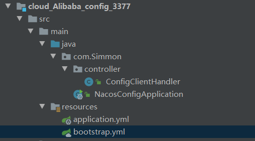

>说明:
>
>​	bootstrap.yml和application.yml的区别
>
>- 若application.yml 和bootstrap.yml 在同一目录下：`bootstrap.yml 先加载 application.yml后加载`
>
>  **bootstrap.yml 用于应用程序上下文的引导阶段。bootstrap.yml 由父Spring ApplicationContext加载。**
>
>区别:
>
>- bootstrap.yml 和 application.yml 都可以用来配置参数。
>
>  ==bootstrap.yml 用来程序引导时执行，应用于更加早期配置信息读取。可以理解成系统级别的一些参数配置，这些参数一般是不会变动的。一旦bootStrap.yml 被加载，则内容不会被覆盖。==
>
>  application.yml 可以用来定义应用级别的， 应用程序特有配置信息，可以用来配置后续各个模块中需使用的公共参数等。
>
>属性覆盖:
>
>- 启动上下文时，Spring Cloud 会创建一个 Bootstrap Context，作为 Spring 应用的 Application Context 的父上下文。
>
>  初始化的时候，Bootstrap Context 负责从外部源加载配置属性并解析配置。这两个上下文共享一个从外部获取的 Environment。Bootstrap 属性有高优先级，默认情况下，它们不会被本地配置覆盖。
>
>  也就是说如果加载的 application.yml 的内容标签与 bootstrap 的标签一致，application 也不会覆盖 bootstrap，而`application.yml 里面的内容可以动态替换。`
>
>**bootstrap.yml使用场景**
>
>- 当使用 Spring Cloud Config Server 配置中心时，这时需要在 bootstrap.yml 配置文件中指定 spring.application.name 和 spring.cloud.config.server.git.uri，添加连接到配置中心的配置属性来加载外部配置中心的配置信息
>  一些固定的不能被覆盖的属性
>  一些加密/解密的场景

因为我这里的yaml文件没有指定所以我还用到了application.yml

application.yml

```yaml
spring:
  profiles:
    #active: test
    active: dev
```

bootstrap.yml

```yaml
server:
  port: 3377
spring:
  application:
    name: nacos-config-client
  cloud:
    nacos:
      discovery:
        server-addr: localhost:8848
      config:
        server-addr: localhost:8848
        file-extension: yaml #指定配置文件格式
```

>注意这里是从nacos服务中心去找

pom.xml

```xml
<dependencies>
        <dependency>
            <groupId>com.alibaba.cloud</groupId>
            <artifactId>spring-cloud-starter-alibaba-nacos-config</artifactId>
        </dependency>

        <dependency>
            <groupId>com.alibaba.cloud</groupId>
            <artifactId>spring-cloud-starter-alibaba-nacos-discovery</artifactId>
        </dependency>

        <dependency>
            <groupId>org.springframework.boot</groupId>
            <artifactId>spring-boot-starter-web</artifactId>
        </dependency>
        <dependency>
            <groupId>org.springframework.boot</groupId>
            <artifactId>spring-boot-starter-actuator</artifactId>
        </dependency>
        <!--热部署-->
        <dependency>
            <groupId>org.springframework.boot</groupId>
            <artifactId>spring-boot-devtools</artifactId>
            <scope>runtime</scope>
            <optional>true</optional>
        </dependency>
        <dependency>
            <groupId>org.projectlombok</groupId>
            <artifactId>lombok</artifactId>
            <optional>true</optional>
        </dependency>
        <dependency>
            <groupId>org.springframework.boot</groupId>
            <artifactId>spring-boot-starter-test</artifactId>
            <scope>test</scope>
        </dependency>
    </dependencies>
```

nacos[^localhost:8848/nacos]

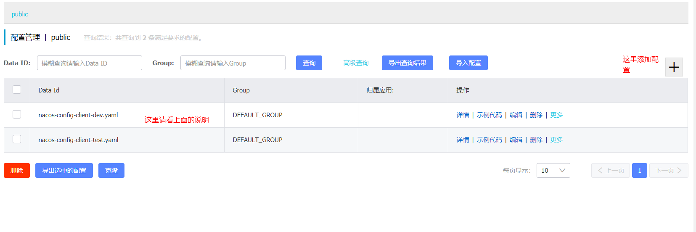

>这里我们通过访问application.yml中`spring,profiles.active`中的后缀来加载不同后缀的文件

nacos-config-client-dev.yaml

```yaml
config:
    info: this is nacos dev version = 3
```

>==注意:这里后缀名一定要是yaml==

nacos-config-client-test.yaml

```YAML
config:
    info: from nacos config center nacos-config-client-test-yaml and version = 2
```

controller.*Handler

```java
@RestController
@RefreshScope //实现动态刷新功能
public class ConfigClientHandler {

    @Value("${config.info}")
    private String configInfo;

    @GetMapping("/config/info")
    public String getConfigInfo(){
        return configInfo;
    }
}
```

启动类

```java
@SpringBootApplication
@EnableDiscoveryClient
public class NacosConfigApplication {
    public static void main(String[] args) {
        SpringApplication.run(NacosConfigApplication.class,args);
    }
}
```

>好处可以不用rabbitMQ实现动态刷新
>
>可以直接从config中改然后它会实时同步页面
>
>例子:
>
>1. 
>
>2. 修改nacos-client-config-dev.yml
>
>   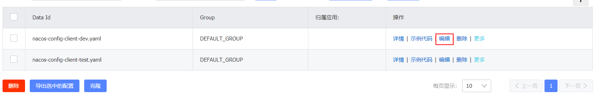
>
>   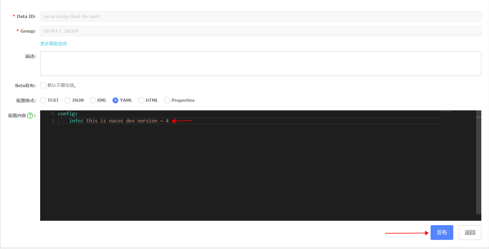
>
>3. 刷新页面
>
>   

>==nacos:==`直接替代了Netflix中的eureka,config,rabbion,Bus`大大的简化了代码

#### 2. GROUP

>nacos应对不同开发环境实现了一个解决方法分组
>
>dev----开发环境
>
>test----测试环境
>
>info----发行环境

group

>当我们创建文件时一般是默认分组(`DEFAULT_GROUP`)
>
>我们可以自己命名

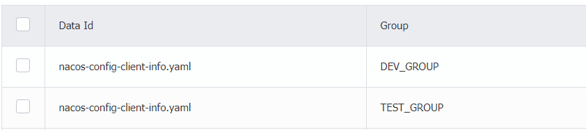

>这里我创建了两个同名的yaml的文件但是分组不同

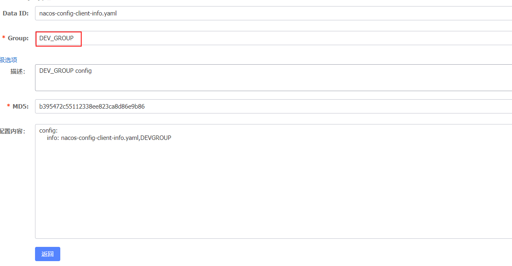

回到3377中的bootstrap.yml(添加group属性)

```yaml
server:
  port: 3377
spring:
  application:
    name: nacos-config-client
  cloud:
    nacos:
      discovery:
        server-addr: localhost:8848
      config:
        server-addr: localhost:8848
        file-extension: yaml #指定配置文件格式
        group: TEST_GROUP
```

修改application.yml

```yaml
spring:
  profiles:
    #active: test
    active: info
```

测试

>访问localhost:3377/config/info
>
>返回:
>
>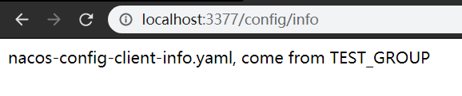

#### 3. 命名空间(namespace)

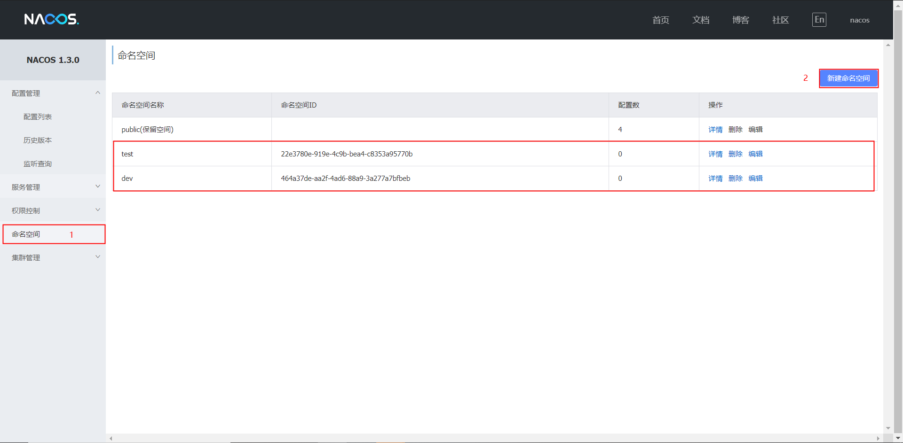

>不用配置命名空间ID让nacos自动生成

创建config文件

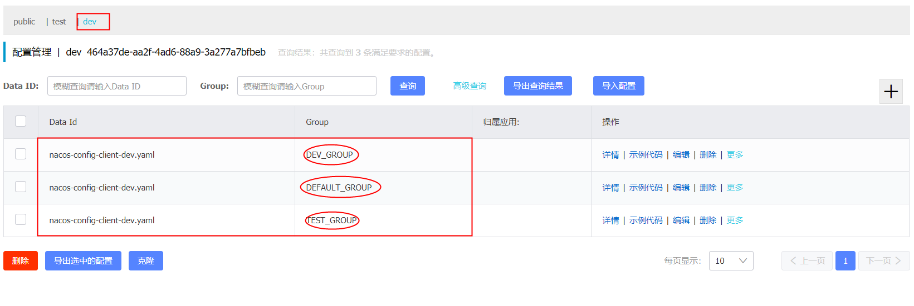

bootstrap.yml增加`namespaces`属性

```yaml
server:
  port: 3377
spring:
  application:
    name: nacos-config-client
  cloud:
    nacos:
      discovery:
        server-addr: localhost:8848
      config:
        server-addr: localhost:8848
        file-extension: yaml #指定配置文件格式
        group: DEV_GROUP
        #这里是你自定义或者nacos生成的命名空间ID
        namespace: 464a37de-aa2f-4ad6-88a9-3a277a7bfbeb
```

application.yml

```yaml
spring:
  profiles:
    active: dev
  	#active: test
    #active: info
```

测试:

>上面为我们会找命名空间id为`464a37de-aa2f-4ad6-88a9-3a277a7bfbeb`,
>
>group----`DEV_GROUP`,
>
>dataid----`nacos-config-client-dev.yaml`的文件
>
>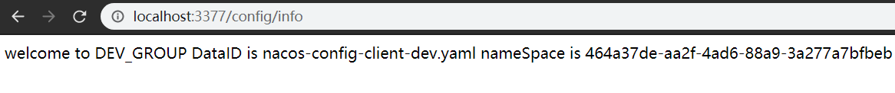

### 3.nacos集群

>`前言`:我这里用了两种方式一个就是linux上的,而一个是docker配置,相对来说docker的简单具体可以自己看

linux下载nacos

> 我这里下载到了/home/mynacos这个目录下

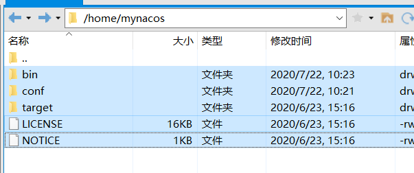

将conf中的mysql脚本执行在linux中的mysql中

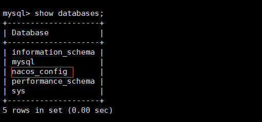

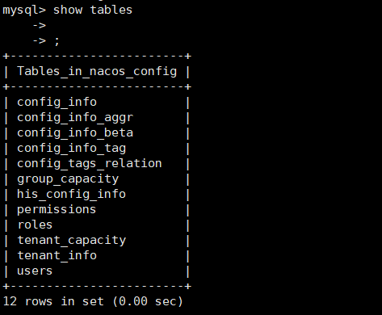

>这里你下载安装好mysql后可以用DataGrip或者sqlyog连接Linux中的数据库来执行sql语句


> `然后`修改conf下的application.properties文件

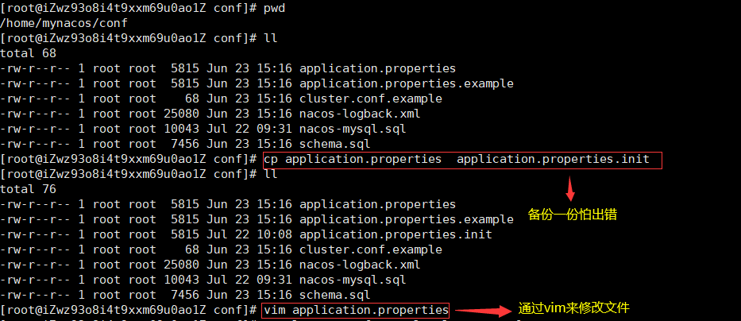

修改向末尾进行追加一下类容[^按i进行添加 esc退出添加 :wq退出保存]

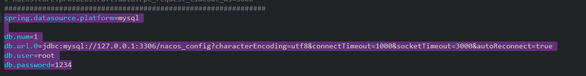

```shell
##############################################################
spring.datasource.platform=mysql

db.num=1
db.url.0=jdbc:mysql://127.0.0.1:3306/nacos_config?characterEncoding=utf8&connectTimeout=1000&socketTimeout=3000&autoReconnect=true
db.user=root
db.password=1234
```

> 修改cluster.conf文件------>注意这里我是将cluster.conf.example 备份后的命令是这个----> `(cp cluster.conf.example cluster.conf)`==一定要查看自身端口号!!!==

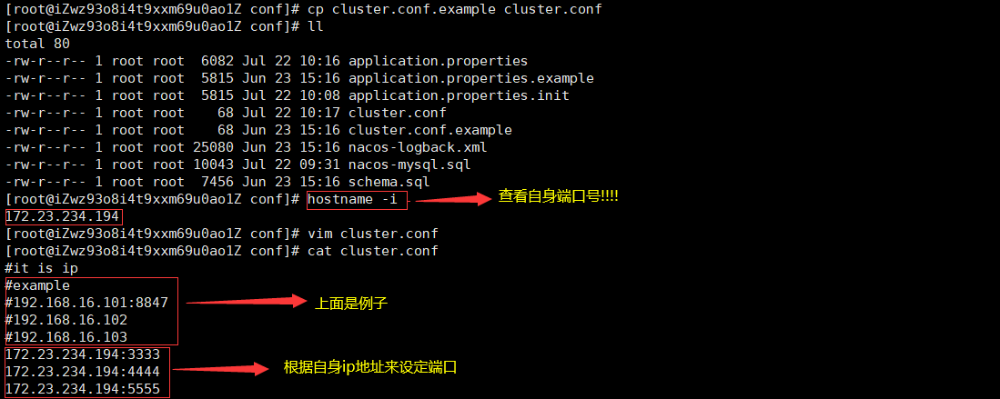

> 后退进入bin目录修改startup.sh文件

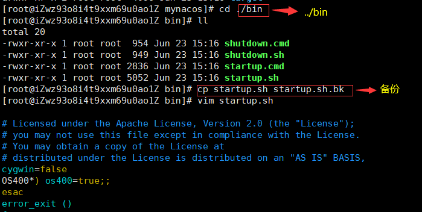

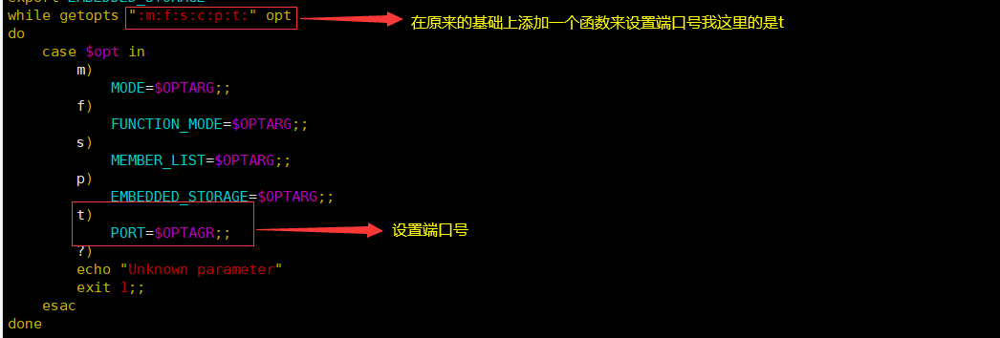

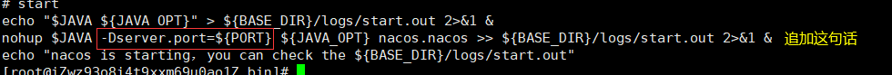

>代码:

```shell
#!/bin/sh

# Copyright 1999-2018 Alibaba Group Holding Ltd.
# Licensed under the Apache License, Version 2.0 (the "License");
# you may not use this file except in compliance with the License.
# You may obtain a copy of the License at

#      http://www.apache.org/licenses/LICENSE-2.0
#
# Unless required by applicable law or agreed to in writing, software
# distributed under the License is distributed on an "AS IS" BASIS,
# WITHOUT WARRANTIES OR CONDITIONS OF ANY KIND, either express or implied.
# See the License for the specific language governing permissions and
# limitations under the License.

cygwin=false
darwin=false
os400=false
case "`uname`" in
CYGWIN*) cygwin=true;;
Darwin*) darwin=true;;
OS400*) os400=true;;
esac
error_exit ()
{
    echo "ERROR: $1 !!"
    exit 1
}
[ ! -e "$JAVA_HOME/bin/java" ] && JAVA_HOME=$HOME/jdk/java
[ ! -e "$JAVA_HOME/bin/java" ] && JAVA_HOME=/usr/java
[ ! -e "$JAVA_HOME/bin/java" ] && JAVA_HOME=/opt/taobao/java
[ ! -e "$JAVA_HOME/bin/java" ] && unset JAVA_HOME

if [ -z "$JAVA_HOME" ]; then
  if $darwin; then

    if [ -x '/usr/libexec/java_home' ] ; then
      export JAVA_HOME=`/usr/libexec/java_home`

    elif [ -d "/System/Library/Frameworks/JavaVM.framework/Versions/CurrentJDK/Home" ]; then
      export JAVA_HOME="/System/Library/Frameworks/JavaVM.framework/Versions/CurrentJDK/Home"
    fi
  else
    JAVA_PATH=`dirname $(readlink -f $(which javac))`
    if [ "x$JAVA_PATH" != "x" ]; then
      export JAVA_HOME=`dirname $JAVA_PATH 2>/dev/null`
    fi
  fi
  if [ -z "$JAVA_HOME" ]; then
        error_exit "Please set the JAVA_HOME variable in your environment, We need java(x64)! jdk8 or later is better!"
  fi
fi

export SERVER="nacos-server"
export MODE="cluster"
export FUNCTION_MODE="all"
export MEMBER_LIST=""
export EMBEDDED_STORAGE=""
while getopts ":m:f:s:c:p:t:" opt  ##这里
do
    case $opt in
        m)
            MODE=$OPTARG;;
        f)
            FUNCTION_MODE=$OPTARG;;
        s)
            SERVER=$OPTARG;;
        c)
            MEMBER_LIST=$OPTARG;;
        p)
            EMBEDDED_STORAGE=$OPTARG;;
        t)
	    	PORT=$OPTARG;;
		?)
        echo "Unknown parameter"
        exit 1;;
    esac
done

export JAVA_HOME
export JAVA="$JAVA_HOME/bin/java"
export BASE_DIR=`cd $(dirname $0)/..; pwd`
export DEFAULT_SEARCH_LOCATIONS="classpath:/,classpath:/config/,file:./,file:./config/"
export CUSTOM_SEARCH_LOCATIONS=${DEFAULT_SEARCH_LOCATIONS},file:${BASE_DIR}/conf/

#===========================================================================================
# JVM Configuration
#===========================================================================================
if [[ "${MODE}" == "standalone" ]]; then
    JAVA_OPT="${JAVA_OPT} -Xms512m -Xmx512m -Xmn256m"
    JAVA_OPT="${JAVA_OPT} -Dnacos.standalone=true"
else
    if [[ "${EMBEDDED_STORAGE}" == "embedded" ]]; then
        JAVA_OPT="${JAVA_OPT} -DembeddedStorage=true"
    fi
    JAVA_OPT="${JAVA_OPT} -server -Xms2g -Xmx2g -Xmn1g -XX:MetaspaceSize=128m -XX:MaxMetaspaceSize=320m"
    JAVA_OPT="${JAVA_OPT} -XX:-OmitStackTraceInFastThrow -XX:+HeapDumpOnOutOfMemoryError -XX:HeapDumpPath=${BASE_DIR}/logs/java_heapdump.hprof"
    JAVA_OPT="${JAVA_OPT} -XX:-UseLargePages"

fi

if [[ "${FUNCTION_MODE}" == "config" ]]; then
    JAVA_OPT="${JAVA_OPT} -Dnacos.functionMode=config"
elif [[ "${FUNCTION_MODE}" == "naming" ]]; then
    JAVA_OPT="${JAVA_OPT} -Dnacos.functionMode=naming"
fi

JAVA_OPT="${JAVA_OPT} -Dnacos.member.list=${MEMBER_LIST}"

JAVA_MAJOR_VERSION=$($JAVA -version 2>&1 | sed -E -n 's/.* version "([0-9]*).*$/\1/p')
if [[ "$JAVA_MAJOR_VERSION" -ge "9" ]] ; then
  JAVA_OPT="${JAVA_OPT} -Xlog:gc*:file=${BASE_DIR}/logs/nacos_gc.log:time,tags:filecount=10,filesize=102400"
else
  JAVA_OPT="${JAVA_OPT} -Djava.ext.dirs=${JAVA_HOME}/jre/lib/ext:${JAVA_HOME}/lib/ext"
  JAVA_OPT="${JAVA_OPT} -Xloggc:${BASE_DIR}/logs/nacos_gc.log -verbose:gc -XX:+PrintGCDetails -XX:+PrintGCDateStamps -XX:+PrintGCTimeStamps -XX:+UseGCLogFileRotation -XX:NumberOfGCLogFiles=10 -XX:GCLogFileSize=100M"
fi

JAVA_OPT="${JAVA_OPT} -Dloader.path=${BASE_DIR}/plugins/health,${BASE_DIR}/plugins/cmdb,${BASE_DIR}/plugins/mysql"
JAVA_OPT="${JAVA_OPT} -Dnacos.home=${BASE_DIR}"
JAVA_OPT="${JAVA_OPT} -jar ${BASE_DIR}/target/${SERVER}.jar"
JAVA_OPT="${JAVA_OPT} ${JAVA_OPT_EXT}"
JAVA_OPT="${JAVA_OPT} --spring.config.location=${CUSTOM_SEARCH_LOCATIONS}"
JAVA_OPT="${JAVA_OPT} --logging.config=${BASE_DIR}/conf/nacos-logback.xml"
JAVA_OPT="${JAVA_OPT} --server.max-http-header-size=524288"

if [ ! -d "${BASE_DIR}/logs" ]; then
  mkdir ${BASE_DIR}/logs
fi

echo "$JAVA ${JAVA_OPT}"

if [[ "${MODE}" == "standalone" ]]; then
    echo "nacos is starting with standalone"
else
    echo "nacos is starting with cluster"
fi

# check the start.out log output file
if [ ! -f "${BASE_DIR}/logs/start.out" ]; then
  touch "${BASE_DIR}/logs/start.out"
fi
# start
echo "$JAVA ${JAVA_OPT}" > ${BASE_DIR}/logs/start.out 2>&1 &
nohup $JAVA -Dserver.port=${PORT} ${JAVA_OPT} nacos.nacos >> ${BASE_DIR}/logs/start.out 2>&1 &
echo "nacos is starting，you can check the ${BASE_DIR}/logs/start.out" ###这里
```

**配置nginx**

> 修改nginx.conf文件 路径/conf下 1111端口号去代理33 44 55这三个集群

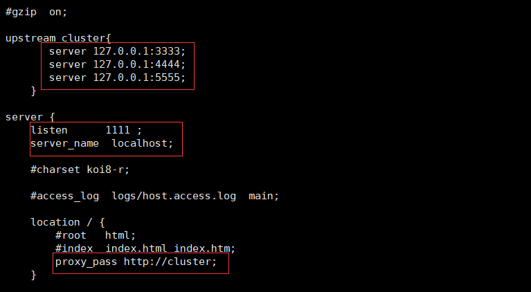

>进入sbin文件

```shell
./nginx -c /路经指向你将才写的conf文件
```

#### docker 配置 nacos集群

>环境
>
>​	docker-compose

```shell
###是否有docker-compose的环境
[root@iZwz93o8i4t9xxm69u0ao1Z conf]# docker-compose --version
docker-compose version 1.26.2, build eefe0d31
```

> ==没有==:cry: ---->[安装网址](https://docs.docker.com/compose/install/)

```shell
###有docker-compose的演示案例
[root@iZwz93o8i4t9xxm69u0ao1Z conf]# git clone https://github.com/nacos-group/nacos-docker.git
###如果没有找到git指令
[root@iZwz93o8i4t9xxm69u0ao1Z conf]# yum install -y git

[root@iZwz93o8i4t9xxm69u0ao1Z conf]# cd /home/nacos-docker/ #clone到的目录
[root@iZwz93o8i4t9xxm69u0ao1Z nacos-docker]# ll
total 32
drwxr-xr-x 5 root root 4096 Jul 23 11:01 build
-rw-r--r-- 1 root root 1845 Jul 23 11:01 changlog
drwxr-xr-x 7 root root 4096 Jul 23 11:46 conf
drwxr-xr-x 2 root root 4096 Jul 23 11:40 env
-rw-r--r-- 1 root root 6396 Jul 23 11:01 README.md
-rw-r--r-- 1 root root 6507 Jul 23 11:01 README_ZH.md
```

> OK现在需要注意: [官方地址](https://nacos.io/zh-cn/docs/quick-start-docker.html)

* 单机模式 Derby

  ```shell
  docker-compose -f example/standalone-derby.yaml up
  ```

* 单机模式 Mysql

  ```shell
  docker-compose -f example/standalone-mysql.yaml up
  ```

* 集群模式

  ```shell
  docker-compose -f example/cluster-hostname.yaml up 
  ```

> **这里的example为了以后方便可以改名字**我用的conf

```shell
[root@iZwz93o8i4t9xxm69u0ao1Z conf]# cd ./env
[root@iZwz93o8i4t9xxm69u0ao1Z env]# ll
total 20
-rw-r--r-- 1 root root  92 Jul 23 11:08 mysql.env
-rw-r--r-- 1 root root 231 Jul 23 11:01 nacos-embedded.env
-rw-r--r-- 1 root root 269 Jul 23 11:40 nacos-hostname.env
-rw-r--r-- 1 root root 224 Jul 23 11:01 nacos-ip.env
-rw-r--r-- 1 root root 213 Jul 23 11:01 nacos-standlone-mysql.env
[root@iZwz93o8i4t9xxm69u0ao1Z env]# vim nacos-hostname.env 
#nacos dev env
PREFER_HOST_MODE=hostname
NACOS_SERVERS=nacos1:8848 nacos2:8848 nacos3:8848
MYSQL_SERVICE_HOST=mysql
MYSQL_SERVICE_DB_NAME=nacos_devtest
MYSQL_SERVICE_PORT=3306
MYSQL_SERVICE_USER=nacos #连接数据库名和密码可以不管这些
MYSQL_SERVICE_PASSWORD=nacos  
JVM_XMS=256m  ###下面这三个配置是看你自己如果运行内存大于4g就不用配置了
JVM_XMX=256m
JVM_XMN=256m
[root@iZwz93o8i4t9xxm69u0ao1Z env]# [root@iZwz93o8i4t9xxm69u0ao1Z env]# cd ../conf
[root@iZwz93o8i4t9xxm69u0ao1Z conf]# ll
total 44
-rw-r--r-- 1 root    root  1021 Jul 23 11:01 cluster-embedded.yaml
-rw-r--r-- 1 root    root  1294 Jul 23 11:45 cluster-hostname.yaml
-rw-r--r-- 1 root    root  1391 Jul 23 11:01 cluster-ip.yaml
drwxr-xr-x 5 root    root  4096 Jul 23 11:25 cluster-logs
drwxr-xr-x 2 root    root  4096 Jul 23 11:01 init.d
drwxr-xr-x 6 polkitd input 4096 Jul 23 12:00 mysql
drwxr-xr-x 3 root    root  4096 Jul 23 11:01 plugins
drwxr-xr-x 2 root    root  4096 Jul 23 11:01 prometheus
-rw-r--r-- 1 root    root   712 Jul 23 11:01 standalone-derby.yaml
-rw-r--r-- 1 root    root   966 Jul 23 11:01 standalone-mysql-5.7.yaml
-rw-r--r-- 1 root    root   640 Jul 23 11:01 standalone-mysql-8.yaml
[root@iZwz93o8i4t9xxm69u0ao1Z conf]# cat cluster-hostname.yaml 
version: "3"
services:
  nacos1:
    hostname: nacos1
    container_name: nacos1
    image: nacos/nacos-server:latest
    volumes:
      - ./cluster-logs/nacos1:/home/nacos/logs
      - ./init.d/custom.properties:/home/nacos/init.d/custom.properties
    ports:
      - "8848:8848"
      - "9555:9555"
    env_file:
      - ../env/nacos-hostname.env
    restart: always
    depends_on:
      - mysql

  nacos2:
    hostname: nacos2
    image: nacos/nacos-server:latest
    container_name: nacos2
    volumes:
      - ./cluster-logs/nacos2:/home/nacos/logs
      - ./init.d/custom.properties:/home/nacos/init.d/custom.properties
    ports:
      - "8849:8848"
    env_file:
      - ../env/nacos-hostname.env
    restart: always
    depends_on:
      - mysql
  nacos3:
    hostname: nacos3
    image: nacos/nacos-server:latest
    container_name: nacos3
    volumes:
      - ./cluster-logs/nacos3:/home/nacos/logs
      - ./init.d/custom.properties:/home/nacos/init.d/custom.properties
    ports:
      - "8850:8848"
    env_file:
      - ../env/nacos-hostname.env
    restart: always
    depends_on:
      - mysql
  mysql:
    container_name: mysql
    image: nacos/nacos-mysql:5.7
    env_file:
      - ../env/mysql.env
    volumes:
      - ./mysql:/var/lib/mysql
    ports:
      - "3308:3306" #怕端口占用所以改了一个外部端口,为3308
```

> 最后

```shell
docker-compose -f cluster-hostname.yaml up #运行这个yaml文件,一定要在指定路径下哦
```

> 运行后

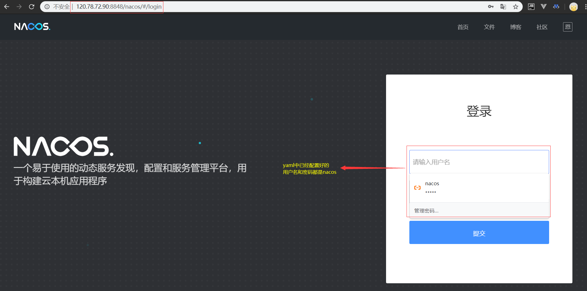

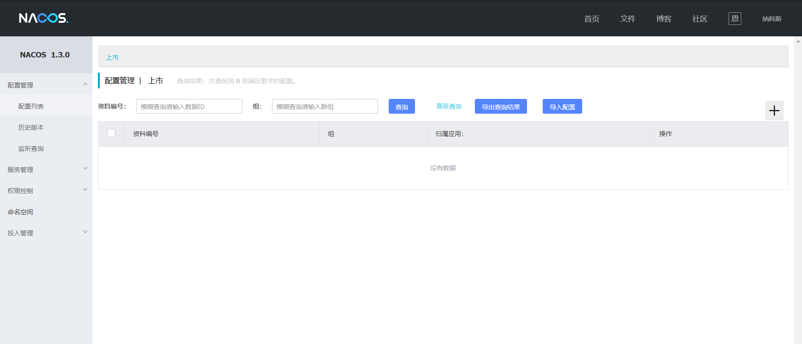

> 数据库

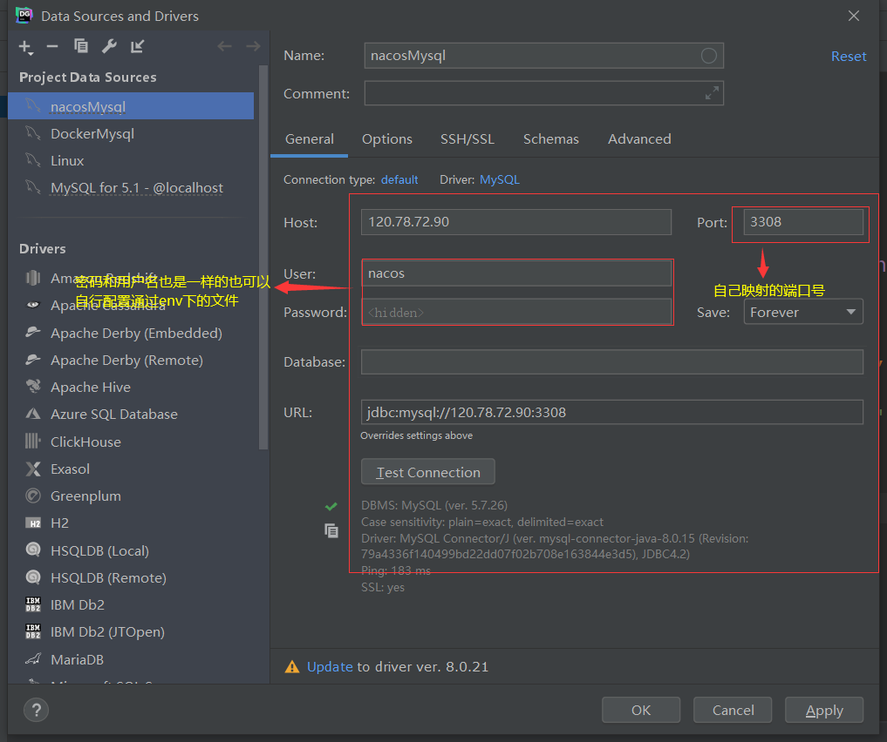

> 测试

**添加一个配置**


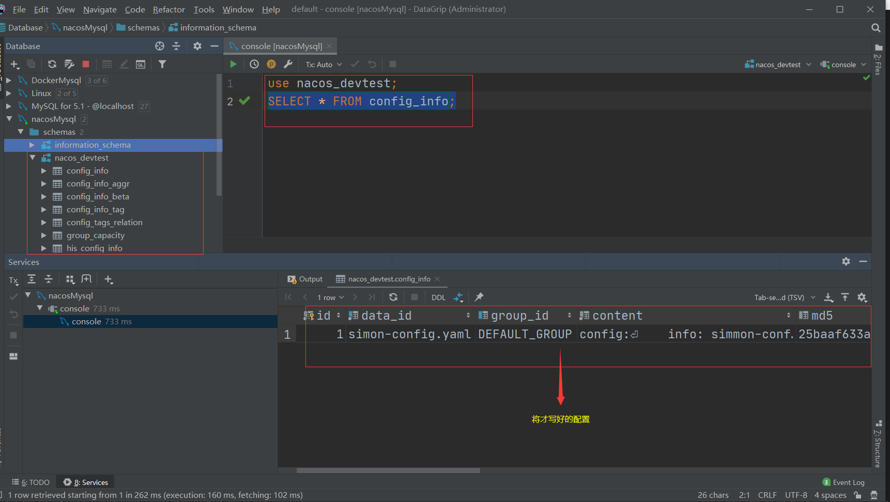

测试二:

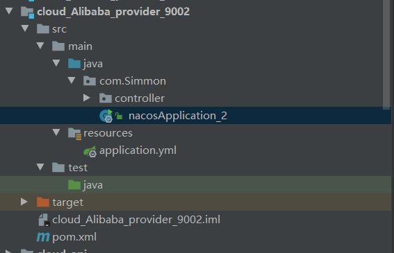

将yaml文件改一下:

application.yaml

```yaml
server:
  port: 9002
spring:
  application:
    name: nacos-payment-provider
  cloud:
    nacos:
      discovery:
        server-addr: http://120.78.72.90:8848 #集群端口号,如果是第一种情况则就是你的ip加端口号1111
        #如我这里的172.23.234.194:1111
      #server-addr: localhost:8848
management:
  endpoints:
    web:
      exposure:
        include: '*'
```

启动微服务

然后在nacos的服务列表中查看

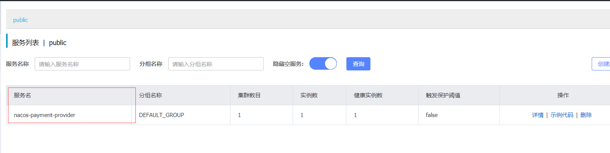


> 完事:joy:
>
> 对了这里启动也有坑,一般启动之后需要等待一会儿,不要只看命令可以的话可以去看看start.out中的日志
>
> `补充:`
>
> ​	下一次需要启动时就用这个命令
>
> ```shell
> * docker-compose -f cluster-hostname.yaml start #注意路径哦,启动
> * docker-compose -f cluster-hostname.yaml stop #停止
> ```

## 2. Sentinel

> 随着微服务的流行，服务和服务之间的稳定性变得越来越重要。Sentinel 以流量为切入点，从流量控制、熔断降级、系统负载保护等多个维度保护服务的稳定性。

Sentinel主要特征

* **丰富的应用场景**
* **完备的实时监控**
* **广泛的开源生态**
* **完善的 SPI 扩展点**

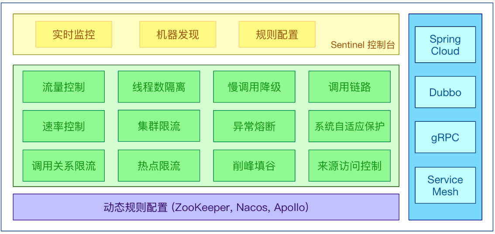

安装[sentinel](https://github.com/alibaba/Sentinel/releases)[^点这里]

下载夹包后用cmd运行即可

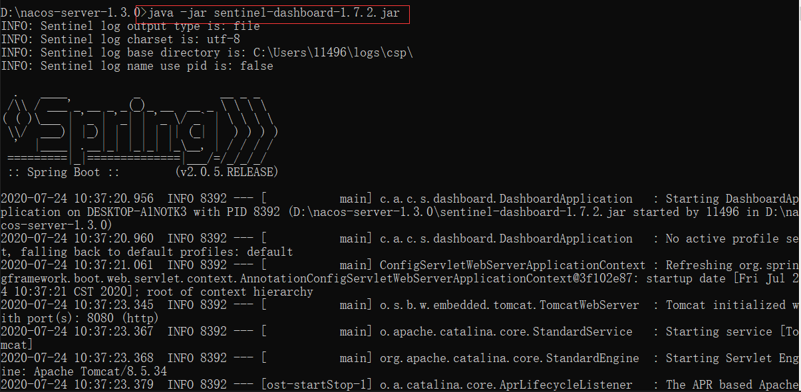

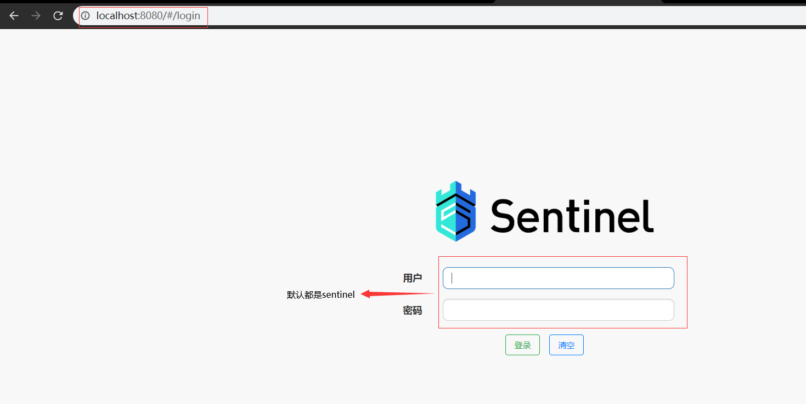

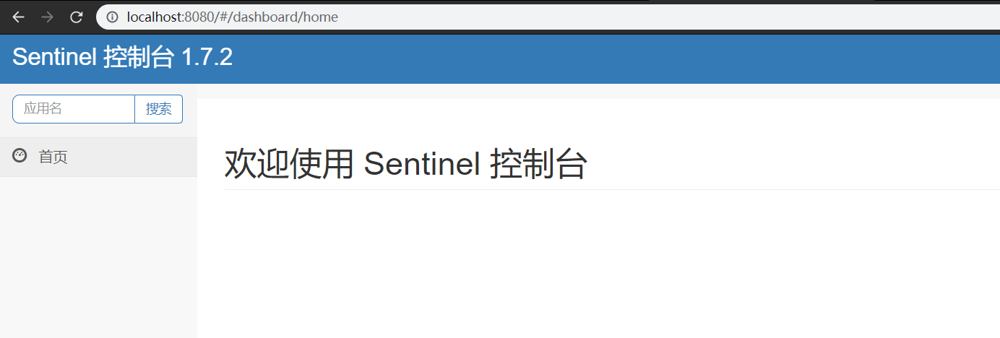

### 初始化

创建子工程

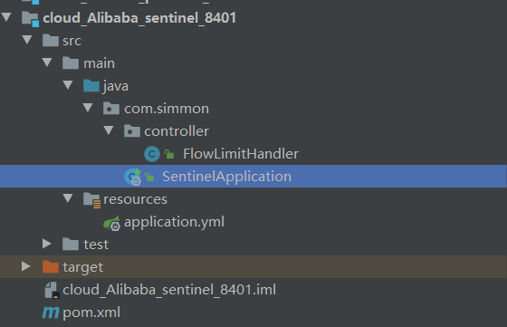

pom.xml

```xml
<dependency>
            <groupId>com.Simmon</groupId>
            <artifactId>cloud_api</artifactId>
            <version>1.0-SNAPSHOT</version>
        </dependency>
        <dependency>
            <groupId>com.alibaba.cloud</groupId>
            <artifactId>spring-cloud-starter-alibaba-nacos-discovery</artifactId>
        </dependency>

        <dependency>
            <groupId>com.alibaba.csp</groupId>
            <artifactId>sentinel-datasource-nacos</artifactId>
        </dependency>

        <dependency>
            <groupId>com.alibaba.cloud</groupId>
            <artifactId>spring-cloud-starter-alibaba-sentinel</artifactId>
        </dependency>

        <dependency>
            <groupId>org.springframework.cloud</groupId>
            <artifactId>spring-cloud-starter-openfeign</artifactId>
        </dependency>

        <dependency>
            <groupId>org.springframework.boot</groupId>
            <artifactId>spring-boot-starter-web</artifactId>
        </dependency>
        <dependency>
            <groupId>org.springframework.boot</groupId>
            <artifactId>spring-boot-starter-actuator</artifactId>
        </dependency>

        <dependency>
            <groupId>org.springframework.boot</groupId>
            <artifactId>spring-boot-devtools</artifactId>
            <scope>runtime</scope>
            <optional>true</optional>
        </dependency>
        <dependency>
            <groupId>org.projectlombok</groupId>
            <artifactId>lombok</artifactId>
            <optional>true</optional>
        </dependency>
        <dependency>
            <groupId>org.springframework.boot</groupId>
            <artifactId>spring-boot-starter-test</artifactId>
            <scope>test</scope>
        </dependency>
```

application.yml

```yaml
server:
  port: 8401
spring:
  application:
    name: cloudAlibaba-sentinel
  cloud:
    nacos:
      discovery:
        server-addr: localhost:8848
    sentinel:
      transport:
        dashboard: localhost:8080
        #默认8719端口,假如端口被调用会向上依次加一扫描直到找到未被占用的端口为止
        port: 8719
management:
  endpoints:
    web:
      exposure:
        include: '*'
```

启动类

```java
@SpringBootApplication
@EnableDiscoveryClient
public class SentinelApplication {
    public static void main(String[] args) {
        SpringApplication.run(SentinelApplication.class,args);
    }
}
```

controller

SentinelHandler

```java
@RestController
public class FlowLimitHandler {

    @GetMapping("/testa")
    public String testA(){
        return "----testA";
    }

    @GetMapping("/testb")
    public String testB(){
        return "----testB";
    }
}
```

>测试:依次启动,注册中心,sentinel,java
>
>==注意:==这里Sentinel是懒加载所以需要访问时才可加载服务

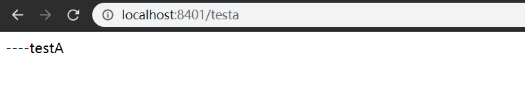

> 先访问页面

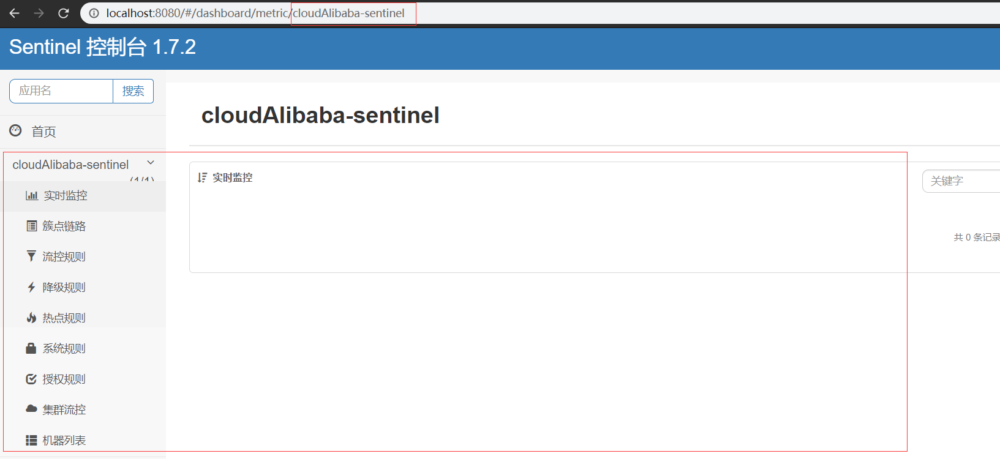

> 完成!

### 流控规则

#### 1. 直接

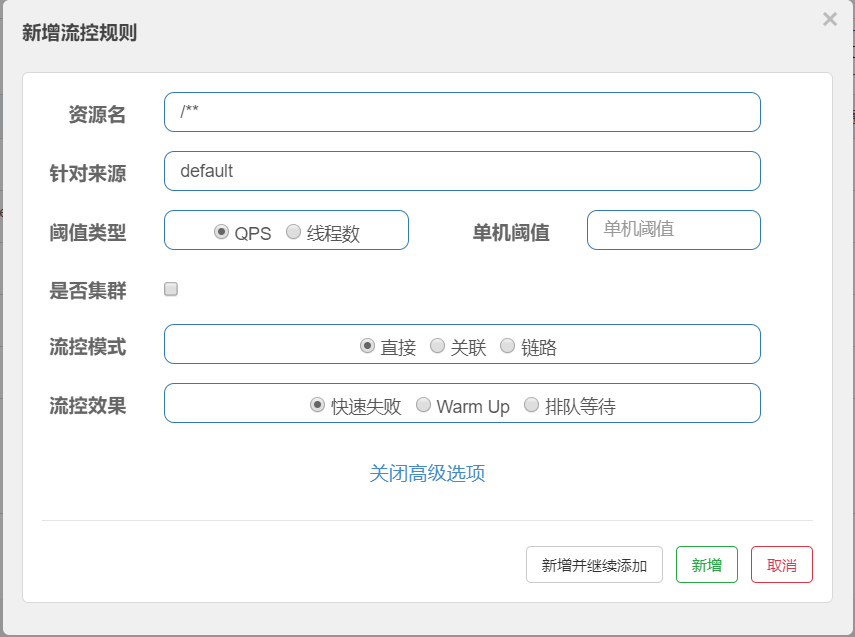

>启动sentinel,nacos,8401

设置一个流量监控

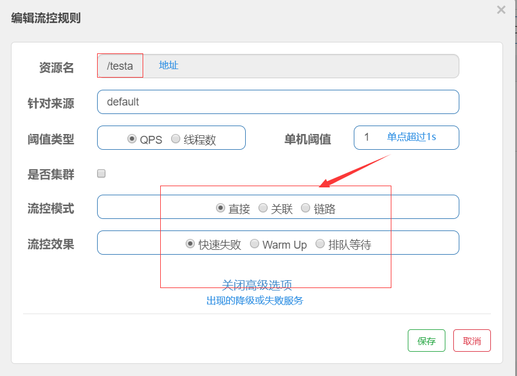

> 单点击超过1s,1次后就会出现报错,这里换成线程数的话最好设置一个睡眠就可以测式了


>说一下`QPS`和`线程数`:
>
>* QPS:每秒查询率（QPS，Queries-per-second）是对一个特定的查询服务器在规定时间内所处理流量多少的衡量标准,即用户单次访问出现刷新次数
>* 线程数:这里简单的看成并发数,当服务器请求1s内,超过规定数时就会报错,即向指定路径发出同样请求数(一定要在同一时间的如:`淘宝双十一12:00时候我们都发出了提交订单的请求`)

#### 2. 关联

> **设置**

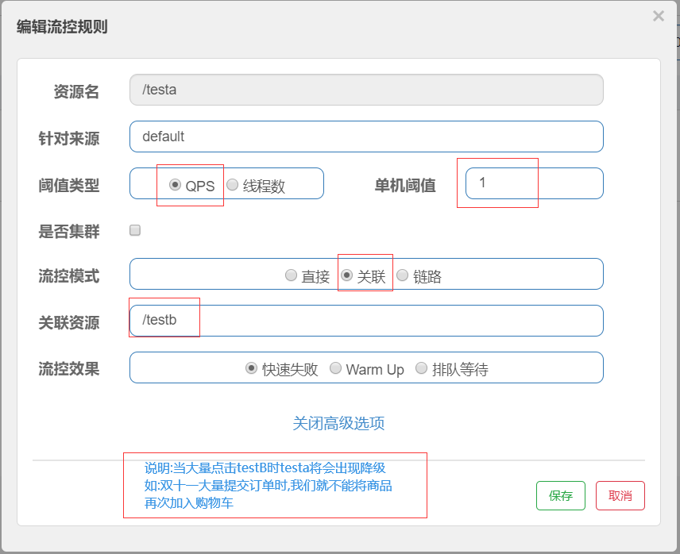

> **测试:** postman

在postman里将testb加入一个集合

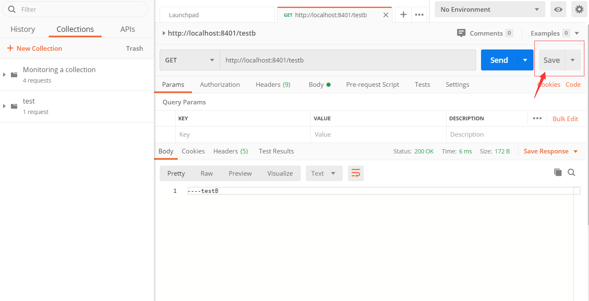


> **出现这个就成功了**

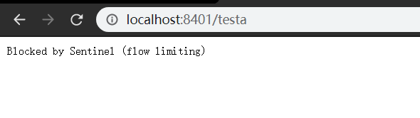

> 当线程跑完后testa就会恢复原来的样子


#### 3. 预热(warm up)

>当流量突然增大的时候，我们常常会希望系统从空闲状态到繁忙状态的切换的时间长一些。即如果系统在此之前长期处于空闲的状态，我们希望处理请求的数量是缓步的增多，经过预期的时间以后，到达系统处理请求个数的最大值。Warm Up（冷启动，预热）模式就是为了实现这个目的的。
>
>默认 `coldFactor` 为 3，即请求 QPS 从 `threshold / 3` 开始，经预热时长逐渐升至设定的 QPS 阈值。

```java
public WarmUpController(double count, int warmUpPeriodInSec) {
        this.construct(count, warmUpPeriodInSec, 3);  /*默认值为三,依次递增*/
    }
```

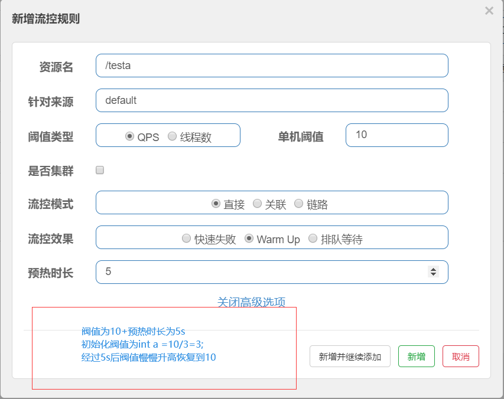

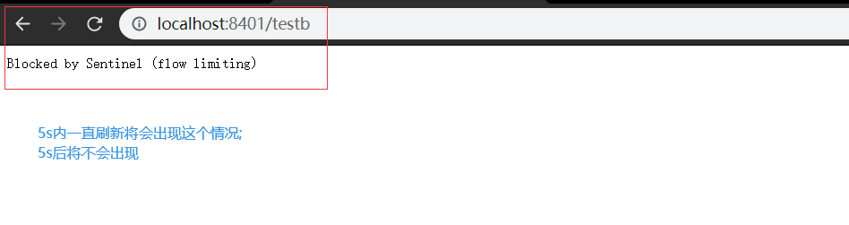

#### 4. 排队

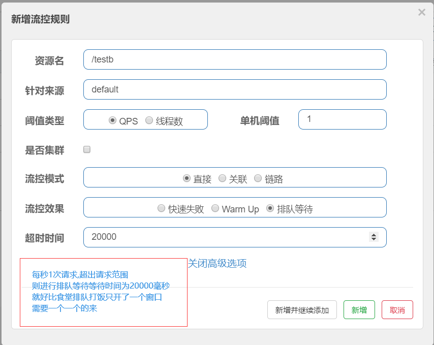

> 添加点东西好看看是哪个线程处理的


> 测试postman

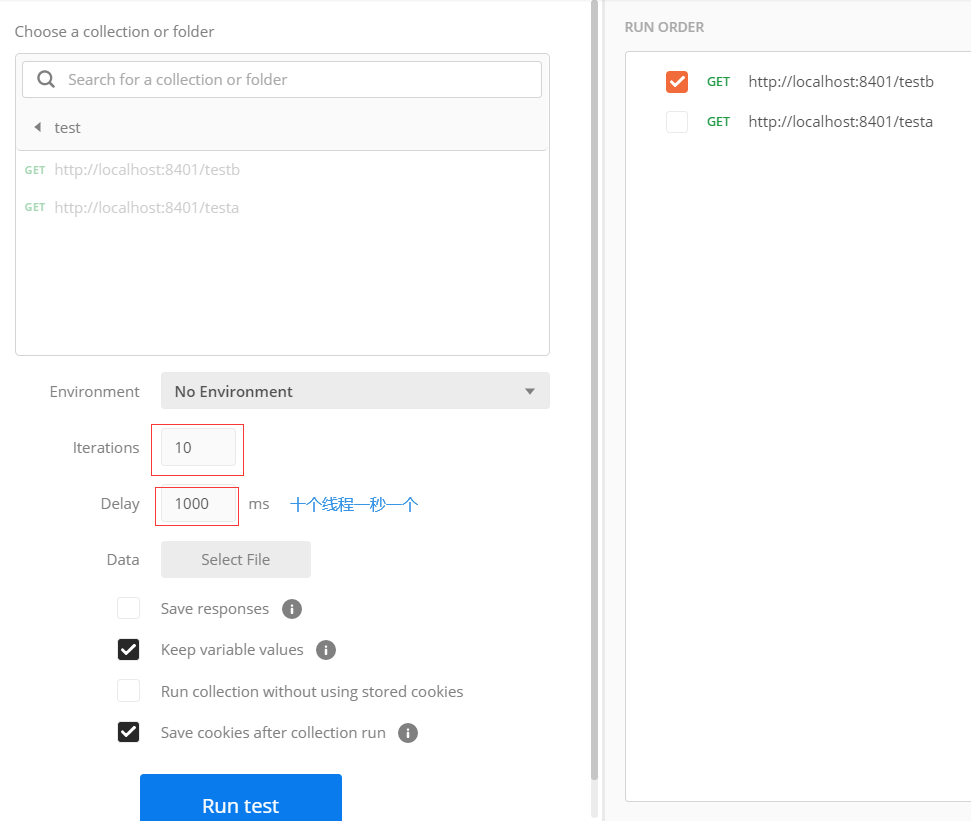

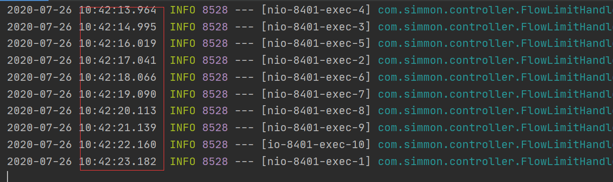

### 降级规则

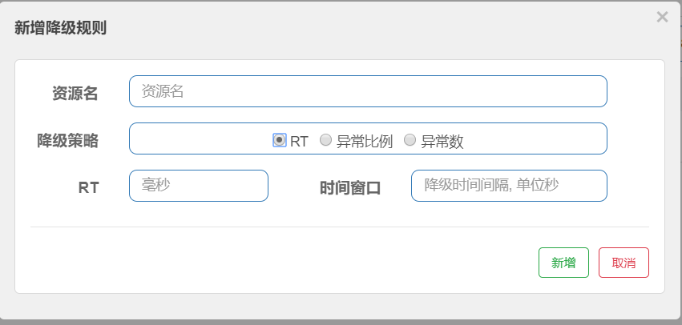

> 以下几种方式来衡量资源是否处于稳定的状态：
>
> - 平均响应时间 (`DEGRADE_GRADE_RT`)：当 1s 内持续进入 N 个请求，对应时刻的平均响应时间（秒级）均超过阈值（`count`，以 ms 为单位），那么在接下的时间窗口（`DegradeRule` 中的 `timeWindow`，以 s 为单位）之内，对这个方法的调用都会自动地熔断（抛出 `DegradeException`）。注意 Sentinel 默认统计的 RT 上限是 4900 ms，**超出此阈值的都会算作 4900 ms**，若需要变更此上限可以通过启动配置项 `-Dcsp.sentinel.statistic.max.rt=xxx` 来配置。
> - 异常比例 (`DEGRADE_GRADE_EXCEPTION_RATIO`)：当资源的每秒请求量 >= N（可配置），并且每秒异常总数占通过量的比值超过阈值（`DegradeRule` 中的 `count`）之后，资源进入降级状态，即在接下的时间窗口（`DegradeRule` 中的 `timeWindow`，以 s 为单位）之内，对这个方法的调用都会自动地返回。异常比率的阈值范围是 `[0.0, 1.0]`，代表 0% - 100%。
> - 异常数 (`DEGRADE_GRADE_EXCEPTION_COUNT`)：当资源近 1 分钟的异常数目超过阈值之后会进行熔断。注意由于统计时间窗口是分钟级别的，若 `timeWindow` 小于 60s，则结束熔断状态后仍可能再进入熔断状态。

#### 1.RT

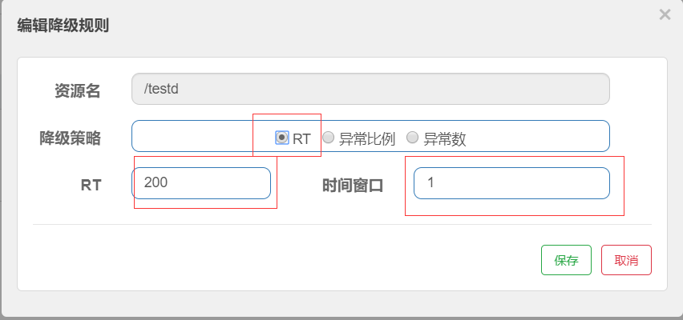

> `意思是`:
>
> ​	在0.2s内处理完所以线程默认最大线程为5如果超过,在未来1s钟的时间窗口内,断路器打开,微服务不可用,保险丝跳闸断电

```java
/*在controller层加上这段代码*/
@GetMapping("/testd")
    public String testD(){
        try {
            TimeUnit.SECONDS.sleep(1);/*线程睡眠一秒这里的意思是没处理一个线程睡眠一秒而我们设置的是只有0.2s处理完所有线程所以在空间期内会出现服务降级报错*/
        } catch (InterruptedException e) {
            e.printStackTrace();
        }
        log.info("testD,测试RT");
        return "----testD";
    }
```

> 测试:
>
> ​	`这里用jmter向地址发送一个10线程数每秒的请求将会出现服务降级`

#### 2.异常比例

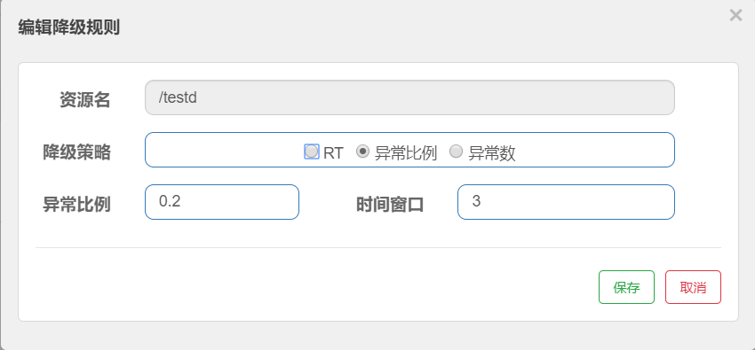

> 意思:
>
> ​	当报错数大于线程总数20%,将会出现降级时间时长为3s,这里所需线程数必须是>=5的

```java
@GetMapping("/testd")
    public String testD(){
        /*try {
            TimeUnit.SECONDS.sleep(1);
        } catch (InterruptedException e) {
            e.printStackTrace();
        }
        log.info("testD,测试RT");
        */

        log.info("testD,异常比例");
        int num=10/0; /*报错点*/
        return "----testD";
    }
```

>测试:
>
>​	jmter发送10线程每秒将会出现服务降级,如果线程数不>=5将会报500
>
>

#### 3.异常数

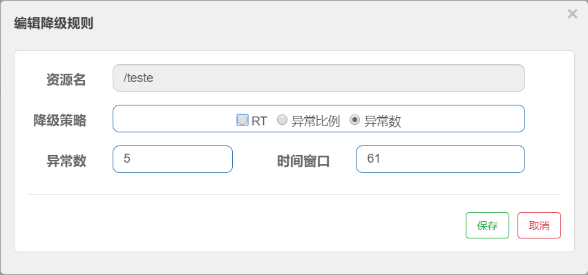

>意思:
>
>​	访问5次后仍报错将会出现服务降级窗口期为61s

```java
@GetMapping("/teste")
    public String testE(){
        log.info("testE,测试异常数");
        int num = 10/0; /*报错*/
        return "----testE";
    }
```

> 测试

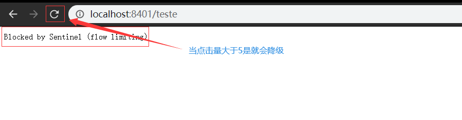

### 热点Key

> 很多时候我们希望统计某个景点数据中访问频次最高的Top K数据，并通过访问进行限制。
>
> * 商品ID为参数，统计统计内部最常购买的商品ID并进行限制
>
> * 用户ID为参数，有针对性地内部转移访问的用户ID进行限制

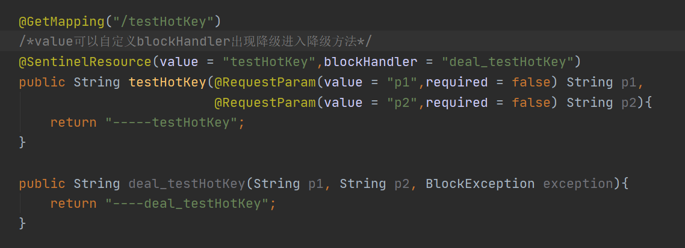

```java
@GetMapping("/testHotKey")
    /*value可以自定义blockHandler出现降级进入降级方法*/
    @SentinelResource(value = "testHotKey",blockHandler = "deal_testHotKey")
    public String testHotKey(@RequestParam(value = "p1",required = false) String p1,
                             @RequestParam(value = "p2",required = false) String p2){
        return "-----testHotKey";
    }

    public String deal_testHotKey(String p1, String p2, BlockException exception){
        return "----deal_testHotKey";
    }
```

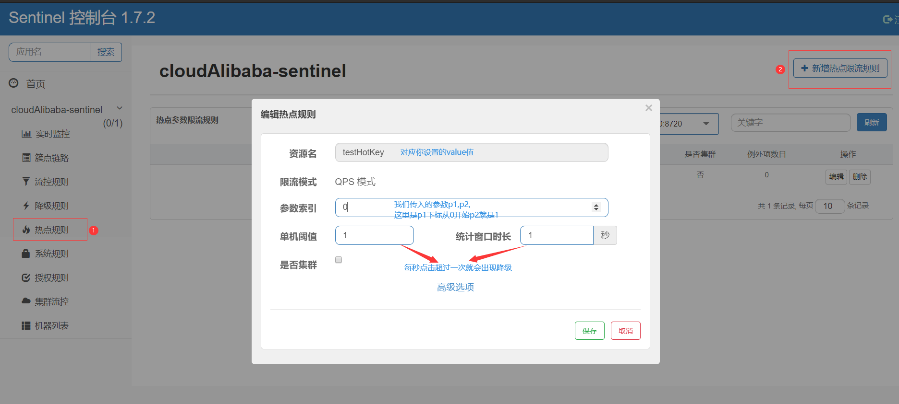

> 测试:
>
> ​	说明我们方法中的p1,p2都是可传可不传的
>
> ​	`只要有p1我们的方法点击超过每秒1次就会出现服务降级进入我们的兜底方法`,不信你可以将p2加上localhost:8401/testHotKey?p1=a&p2=b

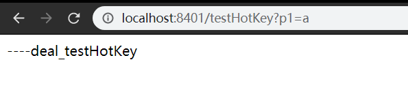

>==注意==:
>
>​	如果我们这样传他会出现降级吗
>
>​	`localhost:8401/testHotKey?p2=a&p1=b`

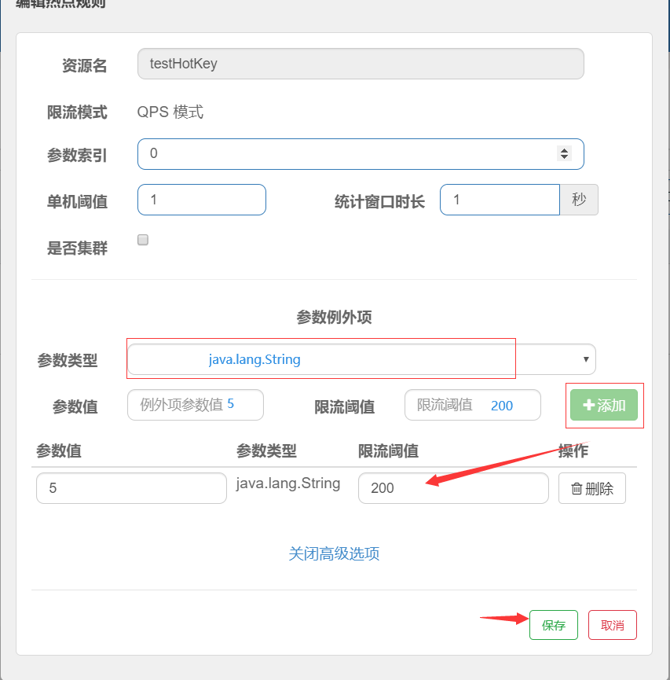

> 测试:
>
> 这里我们将p1设了一个特殊值5,如果传入值为5则将在每秒不超过200次的点击量情况下不出现降级

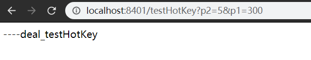

>出现了降级,这里说明了代码的识别性
>
>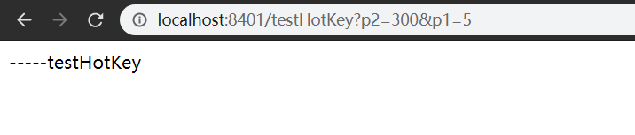

### 系统规则

>这里我就不写了简单说一下
>
>​	系统规则就是我们将整个服务最外面包了一层如:
>
>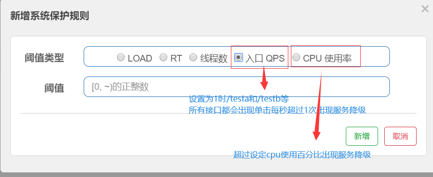

### @SentinelResource

>默认支持==public==不支持private

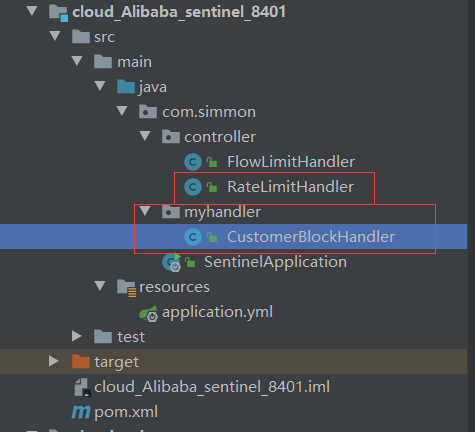

创建一个新的controler类

```java
@RestController
public class RateLimitHandler {

    @GetMapping("/byResource")
    @SentinelResource(value = "byResource",blockHandler = "handleException")
    public CommonResult byResource(){
        return new CommonResult(200,"按资源名称限流测试ok",new Payment(2020L,"serial001"));

    }

    public CommonResult handleException(BlockException exception){
        return new CommonResult(444,exception.getClass().getCanonicalName()+"\t服务不可用");
    }
```

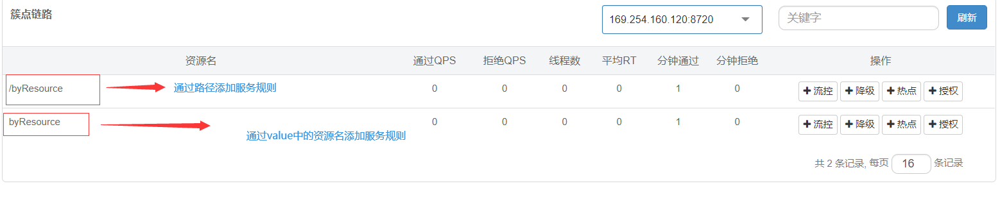

>缺点:
>
>​	冗长代码,增加了耦合度

**改进:**

我们将一个类写好blockHandler,如myhandler中的CustomerBlockHandler

```java
public class CustomerBlockHandler {
    public static CommonResult handlerException(BlockException blockException){
        return new CommonResult(400,"按客户自定义名称限流测试error handlerException----1");
    }
    public static CommonResult handlerException2(BlockException blockException){
        return new CommonResult(400,"按客户自定义名称限流测试error handlerException----2");
    }
}
```

这样我们在从controller中调用

```java
@GetMapping("/rateLimit/customerHandler")
    @SentinelResource(value = "customerHandler",
            blockHandlerClass = CustomerBlockHandler.class,/*调用的资源类一定要是static*/
            blockHandler = "handlerException2")/*调用资源的方法名*/
    public CommonResult customerHandler(){
        return new CommonResult(200,"按客户自定义名称限流测试ok",new Payment(2020L,"serial001"));
    }
```

==OK!==

### 服务熔断

> **fallback**降级

创建9003,9004,实现负载均衡

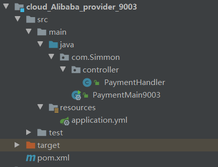

pom.xml

```xml
<dependencies>
        <!-- SpringCloud ailibaba nacos-->
        <dependency>
            <groupId>com.alibaba.cloud</groupId>
            <artifactId>spring-cloud-starter-alibaba-nacos-discovery</artifactId>
        </dependency>
        <!-- SpringCloud ailibaba sentinel-->
        <dependency>
            <groupId>com.alibaba.cloud</groupId>
            <artifactId>spring-cloud-starter-alibaba-sentinel</artifactId>
        </dependency>
        <dependency><!-- 引用自己定义的api通用包，可以使用Payment支付Entity -->
            <groupId>com.Simmon</groupId>
            <artifactId>cloud_api</artifactId>
            <version>1.0-SNAPSHOT</version>
        </dependency>
        <dependency>
            <groupId>org.springframework.cloud</groupId>
            <artifactId>spring-cloud-starter-openfeign</artifactId>
        </dependency>
        <dependency>
            <groupId>org.springframework.boot</groupId>
            <artifactId>spring-boot-starter-web</artifactId>
        </dependency>
        <!--监控-->
        <dependency>
            <groupId>org.springframework.boot</groupId>
            <artifactId>spring-boot-starter-actuator</artifactId>
        </dependency>
        <!--热部署-->
        <dependency>
            <groupId>org.springframework.boot</groupId>
            <artifactId>spring-boot-devtools</artifactId>
            <scope>runtime</scope>
            <optional>true</optional>
        </dependency>
        <dependency>
            <groupId>org.projectlombok</groupId>
            <artifactId>lombok</artifactId>
            <optional>true</optional>
        </dependency>
        <dependency>
            <groupId>org.springframework.boot</groupId>
            <artifactId>spring-boot-starter-test</artifactId>
            <scope>test</scope>
        </dependency>
    </dependencies>
```

application.yml

```yaml
server:
  port: 9003
spring:
  application:
    name: nacos-payment-provider
  cloud:
    nacos:
      discovery:
        server-addr: localhost:8848
#暴露所有端点
management:
  endpoints:
    web:
      exposure:
        include: '*'
```

启动类:

```java
@SpringBootApplication
@EnableDiscoveryClient
public class PaymentMain9003 {
    public static void main(String[] args) {
        SpringApplication.run(PaymentMain9003.class,args);
    }
}
```

controller

```java
@RestController
public class PaymentHandler {
    @Value("${server.port}")
    private String serverPort;

    public static HashMap<Long, Payment> hashMap =new HashMap<Long, Payment>();
    static {
        hashMap.put(1L,new Payment(1L,"asdasdadadadadadadad"));
        hashMap.put(2L,new Payment(2L,"asdasdasdasdwrasfafa"));
        hashMap.put(3L,new Payment(3L,"vsdvsddsffdsfdsfdsfs"));
    }/*这里模拟了一个数据库的操作所以yaml没有连接数据库*/

    @GetMapping("/paymentSQL/{id}")
    public CommonResult<Payment>  paymentSQL(@PathVariable("id") Long id){
        Payment payment =hashMap.get(id);
        CommonResult<Payment> result=new CommonResult<Payment>(200,"from sql,serverPort:"+serverPort,payment);
        return result;
    }
}
```

>9004是一样的

**接着**

创建84

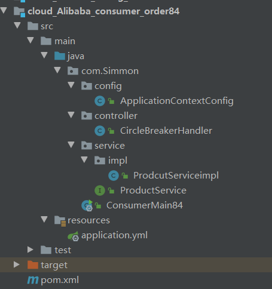

pom.xml

```xml
<dependencies>
        <!-- SpringCloud ailibaba nacos-->
        <dependency>
            <groupId>com.alibaba.cloud</groupId>
            <artifactId>spring-cloud-starter-alibaba-nacos-discovery</artifactId>
        </dependency>
        <!-- SpringCloud ailibaba sentinel-->
        <dependency>
            <groupId>com.alibaba.cloud</groupId>
            <artifactId>spring-cloud-starter-alibaba-sentinel</artifactId>
        </dependency>
        <dependency><!-- 引用自己定义的api通用包，可以使用Payment支付Entity -->
            <groupId>com.Simmon</groupId>
            <artifactId>cloud_api</artifactId>
            <version>1.0-SNAPSHOT</version>
        </dependency>
        <dependency>
            <groupId>org.springframework.cloud</groupId>
            <artifactId>spring-cloud-starter-openfeign</artifactId>
        </dependency>
        <dependency>
            <groupId>org.springframework.boot</groupId>
            <artifactId>spring-boot-starter-web</artifactId>
        </dependency>
        <!--监控-->
        <dependency>
            <groupId>org.springframework.boot</groupId>
            <artifactId>spring-boot-starter-actuator</artifactId>
        </dependency>
        <!--热部署-->
        <dependency>
            <groupId>org.springframework.boot</groupId>
            <artifactId>spring-boot-devtools</artifactId>
            <scope>runtime</scope>
            <optional>true</optional>
        </dependency>
        <dependency>
            <groupId>org.projectlombok</groupId>
            <artifactId>lombok</artifactId>
            <optional>true</optional>
        </dependency>
        <dependency>
            <groupId>org.springframework.boot</groupId>
            <artifactId>spring-boot-starter-test</artifactId>
            <scope>test</scope>
        </dependency>
    </dependencies>
```

application.yml

```yaml
server:
  port: 84
spring:
  application:
    name: nacos-order-consumer
  cloud:
    nacos:
      discovery:
        server-addr: localhost:8848
    sentinel:
      transport:
        dashboard: localhost:8080
        port: 8719
service-url:
  nacos-user-service: http://nacos-payment-provider
#开启Sentinel对feign的支持
feign:
  sentinel:
    enabled: true
```

config

```java
@Configuration
public class ApplicationContextConfig {
    @Bean
    @LoadBalanced
    /*利用restTemplate实现负载均衡*/
    public RestTemplate getResetTemplate(){
        return new RestTemplate();
    }
}
```

service

ProductService.class

```java
@FeignClient(value = "nacos-payment-provider",fallback = ProdcutServiceimpl.class)/*这里跟前面的feign是一样的,给服务一个默认兜底的方法,nacos-payment-provider提供微服务名*/
@Repository
public interface ProductService {
    @GetMapping("/paymentSQL/{id}")
    public CommonResult<Payment> paymentSQL(@PathVariable("id") Long id);
}
```

impl

ProductServiceimpl.class

```java
@Component
public class ProdcutServiceimpl implements ProductService {
    public CommonResult<Payment> paymentSQL(Long id) {
        return new CommonResult<Payment>(444,"服务降级返回",new Payment(id,"error"));
    }
}
```

controller

```java
@RestController
@RequestMapping("/consumer")
@Slf4j
public class CircleBreakerHandler {
    public static final String SERVICE_URL="http://nacos-payment-provider";

    @Autowired
    private RestTemplate restTemplate;

    @GetMapping("/fallback/{id}")
    //@SentinelResource(value = "fallback")没有fallback
    //@SentinelResource(value = "fallback",fallback = "handlerFallback")
    //@SentinelResource(value = "fallback",blockHandler = "blockHandler")
    @SentinelResource(value = "fallback",blockHandler = "blockHandler",fallback = "handlerFallback",
    exceptionsToIgnore = {IllegalArgumentException.class})/*exceptionsToIgnore:不考虑的异常*/
    public CommonResult<Payment> fallback(@PathVariable("id") Long id){
        CommonResult<Payment> result=restTemplate.getForObject(SERVICE_URL+"/paymentSQL/"+id,CommonResult.class,id);
        if (id==4){
            throw new IllegalArgumentException("IllegalArgument,非法参数异常");
        }else if(result.getData()==null){
            throw new NullPointerException("NullPointer,没有该id记录,空指针异常");
        }
        return result;
    }
    /*fallback*/
    public CommonResult<Payment> handlerFallback(@PathVariable("id") Long id,Throwable e){
        Payment payment=new Payment(id,null);
        return new CommonResult<Payment>(444,"兜底异常handlerFallback,exception内容"+e.getMessage(),payment);
    }
    /*blockHandler*/
    public CommonResult<Payment> blockHandler(@PathVariable("id") Long id, BlockException e){
        Payment payment=new Payment(id,null);
        return new CommonResult<Payment>(445,"被sentinel限流,blockException内容"+e.getMessage(),payment);
    }

    /*fegin*/
    @Autowired
    private ProductService productService;

    @GetMapping("/paymentSQL/{id}")
    public CommonResult<Payment> paymentSQL(@PathVariable("id") Long id){
        return productService.paymentSQL(id);
    }
}
```

> 测试

1. 负载均衡

   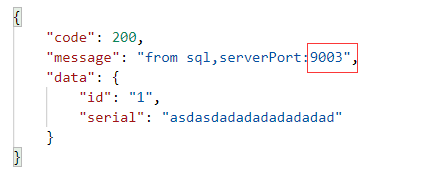

   

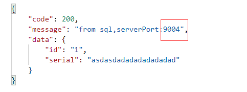

**成功**

2. 服务降级

   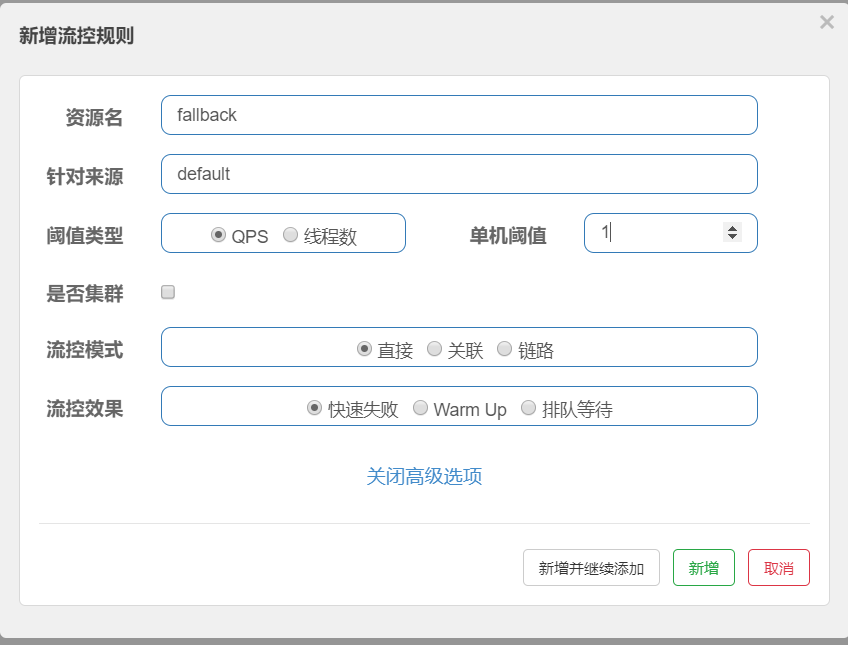


**成功**

3. 服务熔断

   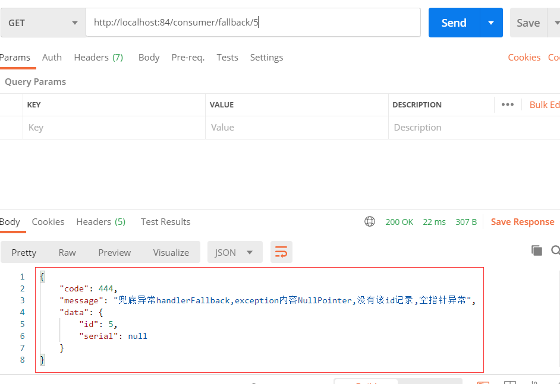

**成功**

5. fegin接口调用

   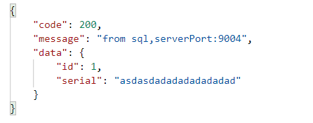

**成功**

2. feign做的服务熔断,停掉9003,9004

   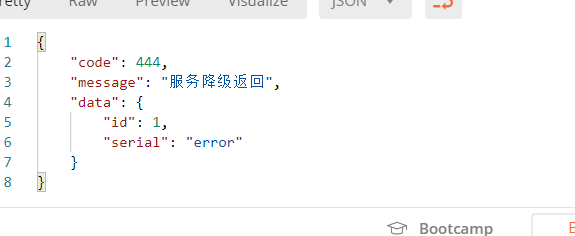

### 规则持久化

> 回到8401

添加依赖

pom.xml

```xml
		<dependency>
            <groupId>com.alibaba.cloud</groupId>
            <artifactId>spring-cloud-starter-alibaba-sentinel</artifactId>
        </dependency>
```

编写application.yml

```yaml
server:
  port: 8401
spring:
  application:
    name: cloudAlibaba-sentinel
  cloud:
    nacos:
      discovery:
        server-addr: localhost:8848
    sentinel:
      transport:
        dashboard: localhost:8080
        #默认8719端口,假如端口被调用会向上依次加一扫描直到找到未被占用的端口为止
        port: 8719
        #下面就是做消息持久化
      datasource:
        ds1:
          nacos:
            server-addr: localhost:8848
            dataId: ${spring.application.name}
            groupId: DEFAULT_GROUP
            data-type: json
            rule-type: flow
management:
  endpoints:
    web:
      exposure:
        include: '*'
```

打开nacos控制台

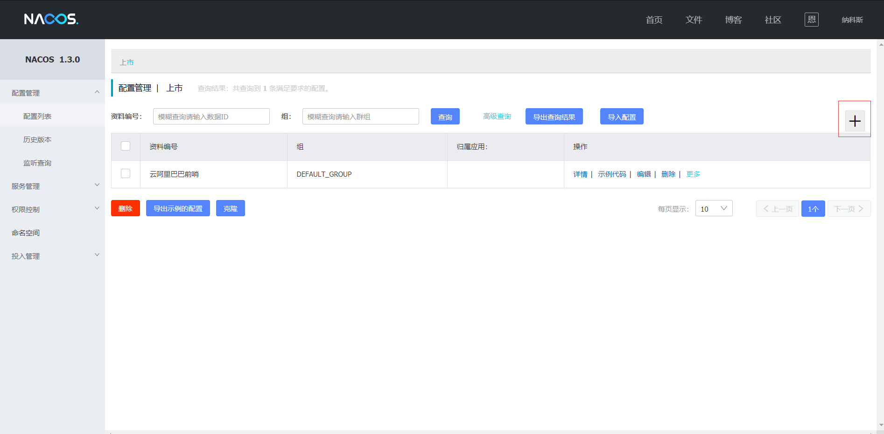


```json
[{
    "resource":"/byResource",
    "limitApp":"default",
    "grade":1,
    "count":1,
    "strategy":0,
    "controlBehavior":0,
    "clusterMode":false
}]

####说明
    "resource": 数据源名称可以写路径,也可以写资源名,如这里"/byResource" 我可以写@SentinelResource自定义的value值;
    "limitApp": 来源应用;
    "grade": 阈值类型,0表示线程数,1表示qps;
    "count": 单机阈值
    "strategy": 流控模式,0表示直接,1表示关联,2表示链路
    "controlBehavior": 流控效果,0表示快速失败,1表示warm up,2表示排队等待
    "clusterMode":false 是否为集群
```

>保存然后重启8401

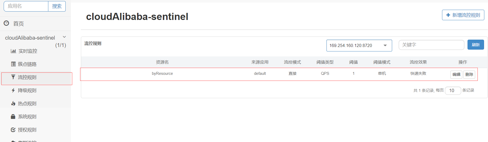

**成功**

> 即使你重启服务或者下一次启动服务这条规则依然会在

## 3. Seata[^具体看官网这里我就不写了]

>Seata有3个基本组成部分：[官网](http://seata.io/zh-cn/index.html)
>
>- **事务协调器（TC）：**维护全局事务和分支事务的状态，驱动全局提交或回滚。
>- **事务管理器TM：**定义全局事务的范围：开始全局事务，提交或回滚全局事务。
>- **资源管理器（RM）：**管理分支事务正在处理的资源，与TC进行对话以注册分支事务并报告分支事务的状态，并驱动分支事务的提交或回滚。

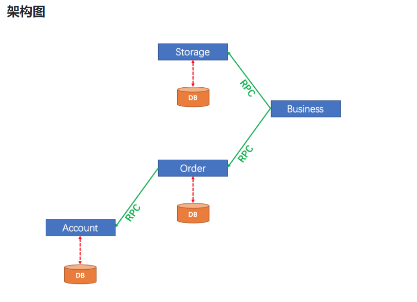


>Seata管理的分布式事务的典型生命周期：
>
>1. TM要求TC开始一项新的全球交易。TC生成代表全局交易的XID。(XID全局唯一事务id)
>2. XID通过微服务的调用链传播。
>3. RM将本地事务注册为XID到TC的相应全局事务的分支。
>4. TM要求TC提交或回滚XID的相应全局事务。
>5. TC驱动相应的XID全局事务下的所有分支事务以完成分支提交或回滚。


